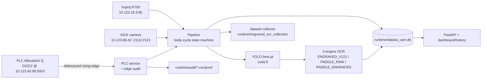
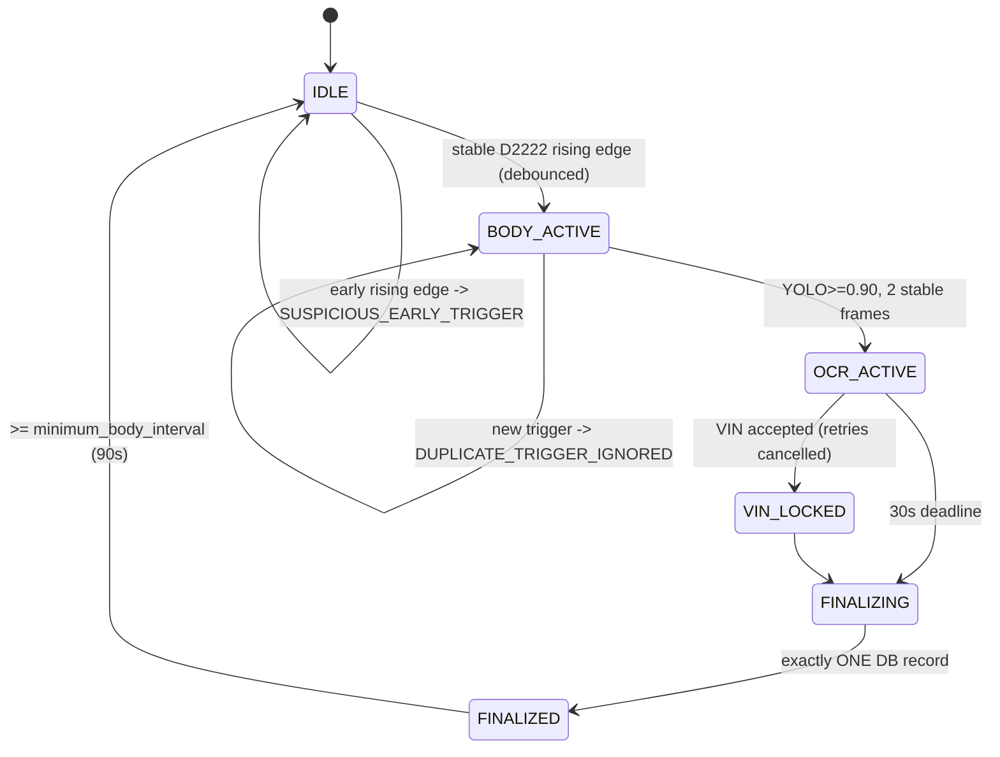
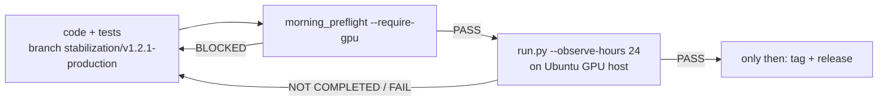

# AI_CAM Architecture (v1.2.1 stabilization)

Industrial engraved-VIN OCR for Station 509. One PLC trigger (**D2222**) starts one
body-cycle that produces exactly **one** final database record.

## System

## Body-cycle state machine (D2222 only; no D2223)

- Real bodies are ≥90 s apart. A trigger during an active cycle, or sooner than
  `minimum_body_interval_sec`, is suppressed + audited (no queue in production).
- RFID runs 30 s in parallel, independent of OCR; a missing tag is `NO_TAG`, not a
  false `TIMEOUT`. Camera plate-exit frees camera/YOLO while RFID continues.
- `finalize(session_id)` is idempotent — N parallel calls → 1 record.

## Path & runtime
Everything derives from `PROJECT_ROOT = Path(__file__)...`; models in `models/`,
writable state in `runtime/{data,logs,crops,temp,backups,engraved_ocr_collection,audit}`.
No `/opt`, `/etc`, `/var`, systemd, or service-user dependency. One command:
`python run.py`.

## Stabilization workflow

No new version tag or release is declared until the 24-hour observation passes.

See `PLC_AND_CONFIG.md`, `OCR_FUSION.md`, `DATASET_CHARACTER_ALIGNMENT.md`,
`FAILURE_EVIDENCE.md` (below), and `PRODUCTION_OBSERVATION.md`.
