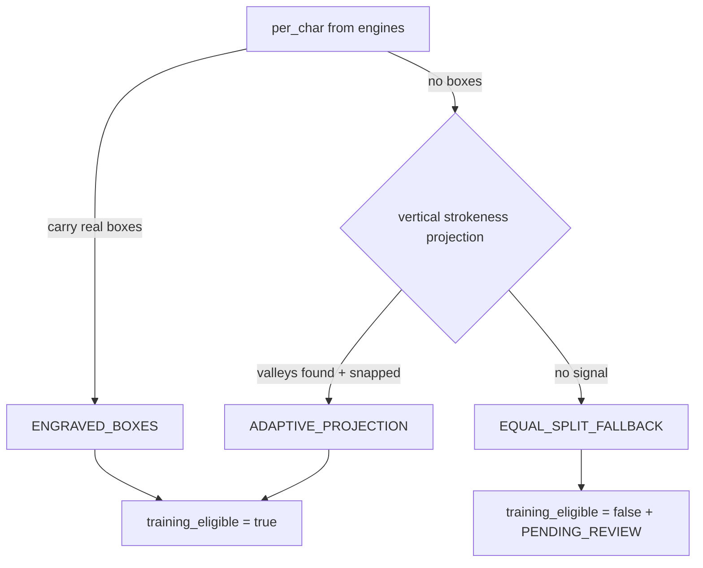

# Dataset Character Alignment (v1.2.1 stabilization)

The active-learning collector turns hard/uncertain production cases into
human-reviewable character crops. v1.2.1 Production Stabilization removes the pure equal-width 17-sector
split from the production training path and records how every crop was aligned.

## Why not equal 17-sector split
VIN characters are **not** equal width: perspective, uneven engraving spacing,
crop padding, and narrow/wide glyphs mean an equal `width/17` split cuts through
characters. Equal split is therefore never a production, training-eligible source.

## Alignment sources (best → fallback)

1. **ENGRAVED_BOXES** — the engine's real per-character segmentation boxes
   (`pc["box"]`), used when supplied. Training-ready.
2. **ADAPTIVE_PROJECTION** — vertical strokeness projection with valley-snapped
   cuts (`_adaptive_boxes`). Training-ready when real valleys are found and snapped.
3. **EQUAL_SPLIT_FALLBACK** — no projection signal / nothing snapped → equal width.
   Marked `training_eligible=false`, `review_status=PENDING_REVIEW`. Debug only.

*(CTC forced alignment on Paddle recognition logits is planned; engraved boxes +
adaptive projection cover current needs.)*

## Metadata (`metadata.json` per session + each DB item)
`alignment_source`, `training_eligible`, `review_status`, plus per-position
`crop_box_json`, `source_hash`, `crop_hash`, `expected_character`, `model_character`,
`paddle_raw_character`, `paddle_enhanced_character`, `collection_reason`. Atomic
writes; SHA-256 dedup.

## Label safety
A validator changing `E→F` does **not** auto-approve the crop as ground-truth `F`.
Such samples stay `PENDING_REVIEW`. A crop becomes `approved` only via manual
review, an authoritative VIN source, an existing ground-truth DB, or ≥2 independent
engines and ≥2 independent frames in agreement. Unsupported classes (V/G) are never
renamed to a known class.

## Acceptance invariant
Production dataset samples with `alignment_source` starting `EQUAL_SPLIT` and
`training_eligible=true` = **0** (enforced by `test_dataset_alignment_v13.py`).
