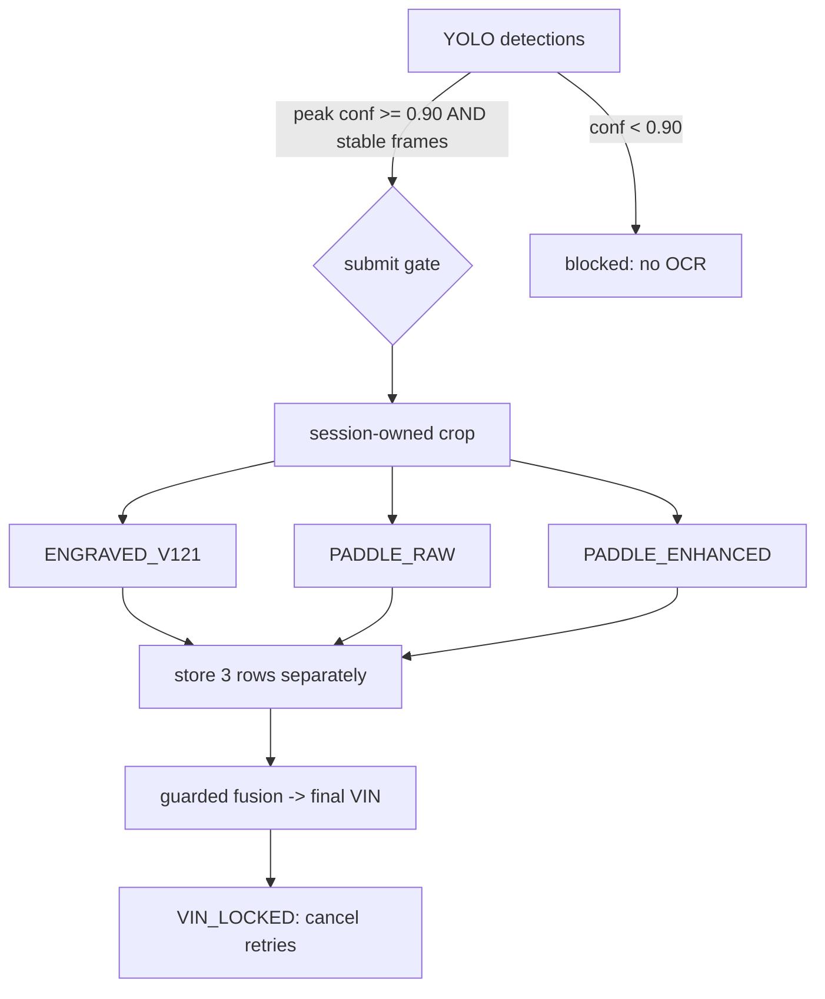

# OCR Fusion & Three-Engine Evidence (v1.3.0)

Every accepted OCR job runs three engines **concurrently** against the same
session-owned crop, stores each result **separately**, and applies a guarded
fusion policy. No character is ever invented; unsupported/uncertain positions
stay `UNKNOWN_CHAR`.

## Engines
| role | engine | input |
|------|--------|-------|
| primary candidate | `ENGRAVED_V121` | ONNX MobileNetV3 char classifier, adaptive segmentation, per-char UNKNOWN gate |
| validator/fallback | `PADDLE_RAW` | real PaddleOCR on the raw/minimally-normalized crop |
| validator/fallback | `PADDLE_ENHANCED` | real PaddleOCR on a documented enhanced (contrast) profile |

Each engine row (`ocr_engine_results`) keeps: `raw_text`, `gated_text`,
`raw_payload_json`, `per_character_json`, `confidence_json`, `boxes_json`,
`preprocessing_profile`, `model_name/version/checksum`, `latency_ms`, `status`,
`error_code`. The single production decision lands in `vin_records.final_ocr_*`.

## Submit gate (v1.3.0 item 1)
`_submit_ocr_frames` enforces **`YOLO peak confidence >= detection.ocr_submit_min_yolo_conf`
(0.90)** before any OCR runs. Crop quality (`best_q`) can no longer override a low
detector confidence. Additional gates: ≥2 stable detections, bbox IoU, crop
sharpness, independent source frame.

## Fusion policy
- Engraved high-confidence, complete, valid 17-char, no UNKNOWN, weak-class policy
  satisfied → primary candidate.
- Paddle RAW/ENHANCED **agreement** raises confidence; **disagreement** is preserved
  as evidence (never silently hybridized into a hand-built string).
- Weak/unknown characters are never auto-substituted; unseen characters are never
  guessed; raw OCR results are stored unchanged.

## F/E · U/V handling (items 4, 5) — `backend/ai/ocr_disagreement.py`
- `char_disagreements()` records per-position disagreement across raw/final/3-engine,
  flagging the engraved confusions `E/F, U/V, V/J, 0/6, 6/8, 0/8` and
  `VALIDATOR_CHANGED_CHARACTER` (a final character no engine actually saw).
- **High-confidence weak-position guard** (`weak_position_ok`): accepting `U/V` or
  `F/E` at high confidence requires **≥2 independent frames** OR **≥2 engine
  agreement** OR **high engraved per-character confidence**. Preprocess variants
  (CLAHE / sharpen / blackhat / rotation) of ONE frame share a `source_frame_hash`
  and count as a single independent observation (item 2), so a lone variant can
  never mint a false positive.

## Retry closure (item 6)
The OCR retry guard only re-submits on genuinely new evidence (new source-frame
hash, higher YOLO confidence, better crop quality, new bbox, new engine result, or
improved margin). Once a VIN is accepted the session is `VIN_LOCKED`: further
retries are cancelled and the final VIN is immutable; late results are audit/dataset
only.
