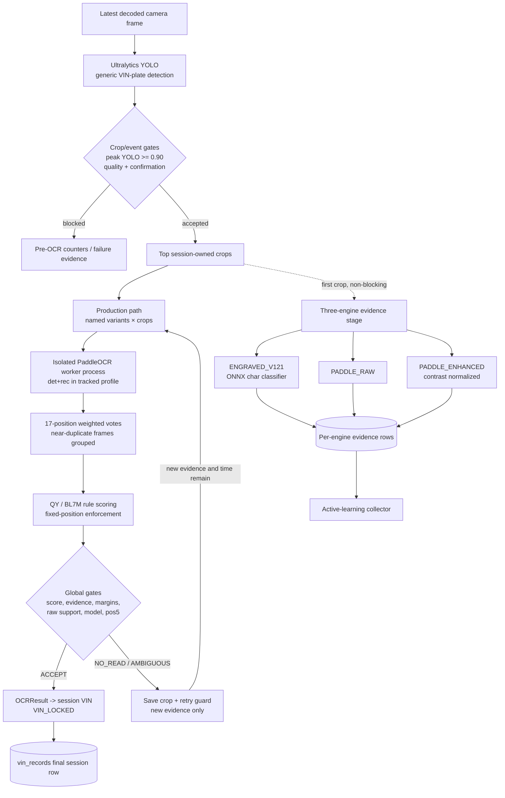
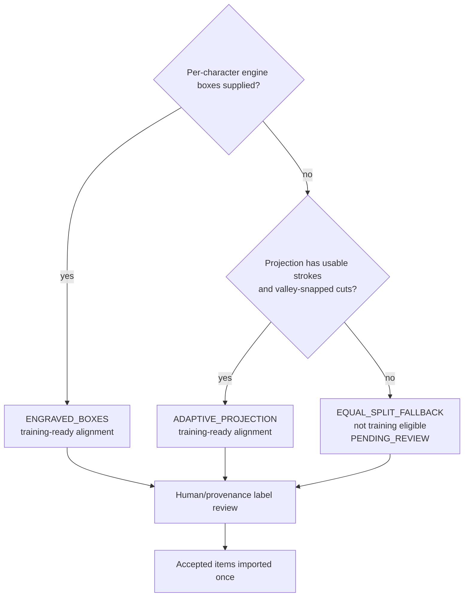

# AI_CAM v1.2.1 AI, OCR, and Computer-Vision Analysis

**Scope:** YOLO detection, production Paddle OCR, Engraved v1.2.1, three-engine
evidence orchestration, VIN validation/fusion, ambiguity handling, dataset
collection/alignment, and model-improvement risks.

**Inspection date:** 2026-07-29

## Technical summary

The current production VIN decision is made by `OCRWorker`: PaddleOCR runs in an
isolated process over multiple crops and named preprocessing variants, then
`vin_fusion.fuse` performs position-level weighted voting and applies strict VIN
acceptance gates. An accepted `OCRResult` is the object that sets
`session.vin` and locks the session (`backend/ai/ocr_worker.py:826-858`;
`backend/pipeline.py:2218-2292`).

In parallel, AI_CAM dispatches the same session-owned first crop to three evidence
engines: Engraved v1.2.1, Paddle RAW, and Paddle Enhanced. They run concurrently,
and their raw/gated evidence is stored. Although the tracked configuration says
`ocr_release.release_mode: GUARDED_PRIMARY`, the live hook invokes this stage with
`write_final=False`; the later production callback records the legacy Paddle
result as `SHADOW_ONLY`. Therefore the Engraved model is currently **evidence and
active-learning support, not the production VIN authority**.

The Engraved model has a real bundled model card: MobileNetV3-Small, 64×64
character inputs, 21 known characters plus REJECT, 155 test samples, 0.742
accuracy, 0.670 macro-F1, 0.839 top-2 accuracy, and about 12.72 ms CPU latency per
character. Its own README states it is not guarded-primary ready because several
classes are weak or absent from the test set
(`models/engraved_ocr_v1.2.1/model_metadata.json:2-30`;
`models/engraved_ocr_v1.2.1/README.md:16-24`).

## OCR decision flow



Source anchors: submission at `backend/pipeline.py:1923-2008`; production cascade
at `backend/ai/ocr_worker.py:666-858`; evidence dispatch at
`backend/ai/ocr_shadow_hook.py:191-220`; session lock at
`backend/pipeline.py:2274-2291`.

## Model and engine inventory

| Component | Runtime role | Artifact/runtime | Verified facts | Current authority |
|---|---|---|---|---|
| VIN-plate detector | Locates plate ROI and supplies confidence/bbox | `models/yolo/best.pt`; Ultralytics `YOLO` | One generic plate class is assumed by downstream code; vehicle model is not assigned by YOLO (`backend/ai/detector.py:156-187`) | Required upstream gate |
| Production Paddle OCR | Reads full VIN strings from crop variants | Local `models/paddle/{det,rec,cls}` through PaddleOCR 2.10.0; child process pool | Tracked profile uses GPU request, det+rec primary, one isolated worker, 16 max tasks (`config/settings.yaml:130-162`) | **Production VIN reader** |
| Engraved v1.2.1 | Classifies 17 adaptively segmented character cells | CPU ONNX Runtime, `model.onnx`; MobileNetV3-Small | 21 characters + REJECT; G/V absent; per-class thresholds; real model metadata | Evidence/collection |
| Paddle RAW | Unmodified common crop through a separate legacy adapter | Separate Paddle adapter/process pool | Raw text preserved and engine relabeled `PADDLE_RAW` (`backend/ai/engines/paddle_profiles.py:42-80`) | Evidence/validator |
| Paddle Enhanced | Contrast-normalized common crop | Separate Paddle adapter/process pool | 2nd/98th percentile contrast stretch, no text mutation (`backend/ai/engines/paddle_profiles.py:31-39`, `83-92`) | Evidence/validator |
| Position-5 verifier | Optional B/C/D/G/H/J visual verifier | HOG-SVM or CNN path | Disabled and no model artifact is present (`config/settings.yaml:219-224`) | Inactive |
| Fixed-slot VIN CNN | Optional 17-slot Paddle assistant/fallback | Expected `models/vin_slot_recognizer_pilot/best.pt` | Disabled; configured artifact is absent (`config/settings.yaml:226-237`) | Inactive |

### Slide-ready model summaries

- **YOLO VIN-plate detector:** “Finds the engraved VIN region, not the vehicle
  model. A confidence/crop-quality gate determines whether OCR is allowed.”
- **Production Paddle OCR:** “Reads several views of the best crops inside a crash-
  isolated worker, then combines character evidence instead of trusting the first
  string.”
- **Engraved v1.2.1:** “A dedicated per-character MobileNetV3 classifier with
  explicit UNKNOWN rejection; useful for disagreement evidence and hard-sample
  mining, but not yet validated strongly enough to own production decisions.”
- **Paddle RAW:** “Independent reading of the unmodified common crop; preserves
  source evidence.”
- **Paddle Enhanced:** “Independent reading after controlled contrast
  normalization; adds diversity for low-contrast metal engraving.”
- **Optional slot/position-5 models:** “Implemented extension points, disabled and
  missing production artifacts in this release.”

## Stage 1: detection and crop selection

`PlateDetector` loads the configured Ultralytics checkpoint, selects GPU/CPU, and
returns `(x1, y1, x2, y2, confidence)` detections
(`backend/ai/detector.py:113-187`). Model identification happens later from the
VIN prefix: `NSTF → QY`, `NSTH → BL7M`
(`backend/ai/vin_rules.py:92-107`).

The event gate:

1. retains the top quality-scored crops from consecutive detections;
2. expands the box by a proportional margin so edge characters are less likely
   to be cut;
3. submits up to the configured `fusion_k` crops;
4. enforces a strict peak YOLO threshold before OCR.

Evidence: `backend/pipeline.py:2088-2126`, `backend/pipeline.py:1939-1949`.

The tracked configuration uses `fusion_k: 4`, `ocr_confirm_frames: 2`, and an
effective strict submit floor of 0.90
(`config/settings.yaml:109-129`; `backend/config.py:128-131`).

### Detector evidence gap

The checkpoint exists, but the repository does not contain a YOLO model card,
dataset manifest, confusion matrix, precision/recall/mAP result, calibration
curve, or exported class map. The code calls the model “YOLOv8n,” but the exact
checkpoint architecture and training provenance were not independently verified
in this analysis. Treat detector quality claims beyond “the checkpoint is bundled
and called by Ultralytics” as **unknown**.

## Stage 2: production Paddle variant cascade

The hot path is `backend/ai/ocr_worker.py`.

### Input diversity

For each selected crop, the worker builds named preprocessing/rotation variants.
The tracked set is:

- `raw_resized`
- `clahe_unsharp`
- `blackhat_relief`
- rotations `0`, `-3`, `+3` degrees
- deskew enabled
- maximum 16 interleaved OCR tasks

Evidence: `config/settings.yaml:157-162`;
`backend/ai/ocr_worker.py:415-441`; variant implementations are in
`backend/ai/ocr_variants.py:111-194`.

The cascade reads RAW/CLAHE families first. It only exits early when an already
accepted result has at least two independent exact-evidence groups and no trusted
full-VIN conflict; otherwise it evaluates the remaining variants
(`backend/ai/ocr_worker.py:587-620`).

### Process isolation

PaddleOCR is constructed inside a child process. Thread counts are constrained,
MKLDNN is disabled by default, project-local det/rec/cls directories are
mandatory, and worker crashes/timeouts are classified separately
(`backend/ai/ocr_process.py:158-250`). The main worker reports
`ENGINE_UNAVAILABLE`, error, timeout, crash, empty, `NO_READ`, and ambiguity as
different outcomes (`backend/ai/ocr_worker.py:743-812`).

This is a strong reliability design: native Paddle faults do not directly kill
the FastAPI/session process.

### Paddle model evidence gap

The repo bundles `.pdmodel`/`.pdiparams` for detector, recognizer, and angle
classifier, and pins PaddleOCR 2.10.0/PaddlePaddle 2.6.2
(`requirements-lock.txt:64-65`). It does not include model-family names,
recognizer dictionary metadata, training provenance, standalone accuracy
metrics, or checksums for these artifacts. Those properties are **unknown**.

## Stage 3: production position-level fusion

Only normalized 17-character reads enter voting
(`backend/ai/vin_fusion.py:388-399`). Near-identical crops are grouped with a
difference hash, so repeated camera frames do not count as independent evidence
(`backend/ai/ocr_worker.py:443-471`).

For each position, direct character votes are weighted by:

```text
OCR confidence × variant weight × crop quality
```

Evidence: `backend/ai/vin_fusion.py:116-130`.

If a directly read character is invalid for the candidate model, weight can be
transferred to allowed visual-confusion neighbors using `confusion_prior`.
Allowed characters do not smear weight into one another
(`backend/ai/vin_fusion.py:133-158`).

Both QY and BL7M layouts are evaluated, then the candidate with the best
structural validity/score is selected. The final score is:

```text
0.50 × structural compliance
+ 0.25 × mean selected-position probability
+ 0.25 × weighted mean OCR confidence
```

Evidence: `backend/ai/vin_fusion.py:402-425`.

### Tracked production gates

| Gate | Tracked value | Purpose |
|---|---:|---|
| Final score | ≥ 0.80 | Reject globally weak candidates |
| Independent crops | ≥ 2 | Require distinct visual evidence |
| Strong multi-variant alternative | ≥ 3 reads | Permit strong same-crop diversity under configured rule |
| Risky-position margin | ≥ 0.20 | Protect positions including 5 and 10 |
| Variable-position margin | ≥ 0.08 | Protect non-fixed characters |
| Serial-position margin | ≥ 0.12 | Protect positions 12–17 |
| Raw support ratio | ≥ 0.50 | Limit rule-only output |
| Known vehicle model | required | Require QY/BL7M prefix |
| Position 5 | dedicated hard gate | Require allowed character, margin, and extra support for structure corrections |
| Trusted exact conflict | none | Reject materially supported competing full VIN |

Configuration: `config/settings.yaml:164-190`. Gate implementation:
`backend/ai/vin_fusion.py:430-489`.

The position-5 gate rejects low margin and unsupported structure-only corrections.
Two narrow rescue paths exist: direct exact consensus, and a configured `3/8 → B`
rescue that still requires strong exact evidence, score, raw support, and no
trusted full-VIN conflict (`backend/ai/vin_fusion.py:491-564`).

## VIN rules and corrections

The rule base defines two 17-position layouts:

- QY prefix: `NSTF`
- BL7M prefix: `NSTH`
- positions 12–17: numeric
- current QY/BL7M allowed sets at intermediate positions are explicitly enumerated

Evidence: `backend/ai/vin_rules.py:45-89`.

The visual confusion map includes pairs such as `E/F`, `0/D/O`, `1/T/J`, `3/B/8`,
`5/S/6`, `6/G/8`, `A/4`, and `Z/2`
(`backend/ai/vin_postprocess.py:33-63`).

### Important correction to existing “never invent” wording

The per-read and fusion code can force model-independent constant positions to
`N`, `S`, `T`, `1`, and `J`, even when the OCR did not directly emit that
character at the position (`backend/ai/vin_rules.py:81-84`;
`backend/ai/vin_postprocess.py:176-188`;
`backend/ai/vin_fusion.py:182-216`).

Therefore the accurate claim is:

> AI_CAM preserves raw OCR and applies auditable, rule-constrained correction;
> variable positions use visual/confusion evidence, while configured fixed
> positions may be enforced.

It is not accurate to claim that the validated VIN never contains a character the
OCR did not see. Raw evidence remains available for audit.

## Three-engine evidence stage

The parallel evidence hook creates:

1. `ENGRAVED_V121`
2. `PADDLE_RAW`
3. `PADDLE_ENHANCED`

All three are required for the stage to become ready
(`backend/ai/ocr_shadow_hook.py:65-109`). `OcrOrchestrator` runs them in a thread
pool with a shared deadline and isolates per-engine errors/timeouts
(`backend/ai/ocr_orchestrator.py:64-99`).

### Intended guarded decision

In `GUARDED_PRIMARY`, the orchestrator:

- accepts a complete, high-confidence Engraved sequence with no UNKNOWN and no
  disabled weak classes;
- otherwise uses exact RAW/Enhanced agreement;
- falls back to one Paddle string when only one is available;
- preserves legacy output on Paddle disagreement;
- never constructs a character-by-character hybrid.

Evidence: `backend/ai/ocr_orchestrator.py:108-160`.

### Actual production integration

The intended decision does not currently own the session:

- pipeline dispatches the common input before production Paddle acceptance
  (`backend/pipeline.py:1988-2003`);
- the hook calls `ShadowOcrStage.process(..., write_final=False)`
  (`backend/ai/ocr_shadow_hook.py:164-183`);
- `ShadowOcrStage` therefore stores evidence but skips its final write
  (`backend/ai/ocr_shadow_stage.py:62-106`);
- the accepted production Paddle callback later writes `SHADOW_ONLY` final
  evidence and sets `session.vin`
  (`backend/ai/ocr_shadow_hook.py:223-252`;
  `backend/pipeline.py:2261-2291`).

This call graph is stronger evidence than the tracked `release_mode:
GUARDED_PRIMARY` comment. The setting affects the parallel orchestrator’s computed
candidate, but that candidate is not propagated into the body-cycle decision.

## Engraved v1.2.1 model

### Architecture and inference

- MobileNetV3-Small character classifier
- grayscale crop, aspect-preserving padding to 64×64, repeated to three channels
- ONNX Runtime CPU provider
- 17 character cells from projection-based valley-snapped segmentation
- per-class confidence thresholds and ≥0.10 top-1/top-2 margin
- rejected/low-confidence characters become `?`

Evidence: `backend/ai/engines/engraved_v121.py:46-75`,
`backend/ai/engines/engraved_v121.py:80-127`,
`backend/ai/engines/engraved_v121.py:130-181`.

### Character contract

The charset is `0123456789ABCDEFHJNST` (21 classes) plus a REJECT output. G and V
are not output classes, so the model cannot emit them
(`models/engraved_ocr_v1.2.1/model_metadata.json:2-14`,
`models/engraved_ocr_v1.2.1/model_metadata.json:154`).

### Reported test performance

| Metric | Reported value |
|---|---:|
| Test samples | 155 |
| Accuracy / top-1 | 0.7419 |
| Balanced accuracy | 0.7005 |
| Macro-F1 | 0.6705 |
| Top-2 | 0.8387 |
| REJECT precision / recall / F1 | 0.946 / 0.761 / 0.843 |
| Mean confidence | 0.8837 |
| CPU latency | 12.72 ms/character |
| ONNX/PyTorch max absolute parity difference | 0.00008 |

Source: `models/engraved_ocr_v1.2.1/model_metadata.json:15-30`.

### Per-class limitations

- Class `5`: F1 0 on 3 samples
  (`models/engraved_ocr_v1.2.1/model_metadata.json:63-68`).
- `6`: F1 0.444 on 3 samples; `7`: F1 0.600 on 5 samples
  (`models/engraved_ocr_v1.2.1/model_metadata.json:69-79`).
- A and H have no reported test support because absent classes are omitted from
  the per-class metric dictionary.
- D has only 2 test samples despite a reported F1 of 1.0
  (`models/engraved_ocr_v1.2.1/model_metadata.json:105-109`).
- Weak-class thresholds are raised from 0.90 to 0.97 for 5/6/7/A/B/D/H
  (`models/engraved_ocr_v1.2.1/confidence_thresholds.json:2-22`).

These sample sizes do not support a strong production-primary claim.

### Training provenance boundary

The training scripts expect an external dataset root
`external_ocr_dataset/character_dataset/splits/production_current_v1`, or an
`AI_CAM_OCR_DATASET_ROOT` override. That dataset is not in this repository
(`tools/train_engraved_v121.py:18-35`).

The trainer uses deterministic seed 1337, grouped splits, class-weighted
cross-entropy, identity-preserving augmentation, and best validation macro-F1
checkpoint selection (`tools/train_engraved_v121.py:47-58`,
`tools/train_engraved_v121.py:60-82`,
`tools/train_engraved_v121.py:115-163`).

The evaluator’s REJECT test subset is a deterministic sorted first-46 selection
described in code as “grouped-ish by index,” not a clearly group-isolated test
partition (`tools/evaluate_engraved_v121.py:31-40`). This is a reproducibility and
confidence limitation.

## Ambiguity and disagreement handling

### Integrated in the production path

- Only 17-character normalized reads enter final fusion.
- I/O/Q are rejected by the standard VIN regex
  (`backend/ai/ocr_worker.py:60-138`).
- Duplicate/near-identical crops share an evidence group.
- Low score, weak margins, insufficient raw support, unknown model, position-5
  uncertainty, or a trusted exact full-VIN conflict produces `OCR_AMBIGUOUS`.
- `NO_READ`, engine unavailable, timeout, crash, and ambiguity save the best crop
  and return a failure callback (`backend/ai/ocr_worker.py:743-823`).
- Retries require a new evidence signature or at least 0.05 quality improvement;
  plate exit and low deadline budget are terminal
  (`backend/ai/ocr_retry_guard.py:61-113`).
- Once accepted, `VIN_LOCKED` makes the final VIN immutable for the session
  (`backend/pipeline.py:1950-1954`, `backend/pipeline.py:2284-2289`).

### Present but not integrated into the live decision

`backend/ai/ocr_disagreement.py` implements:

- per-position F/E, U/V, V/J, 0/6, 6/8, 0/8 disagreement records;
- counting distinct `source_frame_hash` values;
- a weak-character corroboration rule requiring two frames, two engines, or high
  Engraved confidence.

Evidence: `backend/ai/ocr_disagreement.py:23-96`.

Repository search found no production caller of `char_disagreements`,
`independent_frame_count`, or `weak_position_ok`; current call sites are tests.
Thus these helpers should be described as **implemented/tested utilities, not an
enforced live acceptance gate**.

## Dataset collection and character alignment

There are two different collectors.

### Detector collector

`DatasetCollector` can save full frames plus YOLO-format boxes in a background
thread with throttling and drop-oldest backpressure
(`backend/ai/dataset_collector.py:38-176`). It is disabled in the tracked
production YAML (`config/settings.yaml:125-128`).

### OCR active-learning collector

The three-engine evidence stage can save:

- source frame and normalized line;
- selected per-character crops;
- expected/model/Paddle characters;
- reasons, hashes, crop boxes, review state, and model version.

The collector is non-blocking and error-isolated
(`backend/ai/ocr_collector.py:60-115`, `backend/ai/ocr_collector.py:116-216`).

### Alignment order



Implementation: `backend/ai/ocr_collector.py:27-57`,
`backend/ai/ocr_collector.py:133-142`,
`backend/ai/ocr_collector.py:169-215`.

### Why equal-width splitting is risky

Equal `width / 17` sectors assume uniform spacing and a rectified, tightly cropped
line. Industrial engraved VINs can have perspective distortion, unequal glyph
width, uneven spacing, padding, glare, and partial boxes. A fixed boundary can cut
through a glyph or merge adjacent strokes, creating a mislabeled character crop.

The current adaptive method improves this by starting near nominal slots and
snapping cuts to low-stroke valleys. It still is not CTC/recognizer-logit forced
alignment, so severe perspective or missing/merged strokes can defeat it. The
fail-safe is appropriate: unsnapped equal-width output is flagged and excluded
from training.

### Live-path alignment and label caveats

1. The live `_collector_job` builds per-character dictionaries without a `box`
   field (`backend/ai/ocr_shadow_stage.py:121-150`). Therefore its current
   producer does not reach the `ENGRAVED_BOXES` branch; it uses adaptive projection
   or the flagged equal-split fallback.
2. Pipeline dispatch does not supply `trusted_vin`
   (`backend/pipeline.py:1992-2000`). The hook’s default is an empty string
   (`backend/ai/ocr_shadow_hook.py:191-197`), so live collection items are
   unlabeled unless another caller supplies an authoritative VIN.
3. `alignment_source` and `training_eligible` are written to collector job/session
   metadata, but the SQLite collection schema and insert list do not store those
   fields (`backend/database/ocr_v121_db.py:58-80`,
   `backend/database/ocr_v121_db.py:150-160`).
4. Reviewed import only consumes database rows marked `ACCEPTED`, then marks them
   `IMPORTED_TO_DATASET` (`tools/import_reviewed_collection.py:12-58`).

These controls prevent automatic ground-truth fabrication, but they also mean the
current live loop is primarily a **review-candidate generator**, not an automatic
training-data generator.

## Strengths

1. **Multi-frame and multi-variant evidence** is evaluated before acceptance.
2. **Native OCR failure containment** protects the main service.
3. **Position-level auditability** retains margins, supports, variants, raw text,
   and gate reasons.
4. **Near-duplicate grouping** prevents repeated frames from faking independent
   corroboration.
5. **Known-model and exact-conflict gates** favor fail-closed ambiguity over a
   confidently wrong VIN.
6. **Dedicated hard-sample collection** focuses model improvement on unknown,
   weak, low-margin, and disagreeing characters.
7. **Bundled Engraved model card/checksums** are materially better than an opaque
   checkpoint.

## Risks and recommended next steps

| Priority | Risk | Recommended evidence-backed action |
|---|---|---|
| High | Tracked `GUARDED_PRIMARY` and actual evidence-only hookup disagree. | Either wire a deliberately validated three-engine result into the session under explicit rollout controls, or rename/configure the stage as SHADOW so operators are not misled. |
| High | Engraved test coverage is too small/uneven; G/V cannot be emitted. | Collect verified G/V/A/H/5/6/7 and confusable F/E, U/V, 0/6/8 samples; rebuild a group-isolated test set before promotion. |
| High | Fixed-position enforcement contradicts literal “never invent” claims. | Preserve raw/final side-by-side and use “rule-constrained correction” language. Add a live disagreement record whenever enforced output was not directly observed. |
| High | Weak-position helpers are not called by runtime code. | Integrate them only after tests specify session evidence, source-frame hashing, and how a failure changes acceptance. Until then, document as planned safeguards. |
| Medium | Live collector lacks authoritative labels and engine boxes. | Pass an authoritative post-cycle VIN only when provenance is trustworthy; propagate segmentation boxes into collector jobs; keep human approval mandatory. |
| Medium | Alignment/training eligibility is not persisted in SQLite. | Add an additive migration and review/import filtering so the database, metadata JSON, and review queue enforce the same eligibility contract. |
| Medium | Paddle and YOLO artifacts lack model cards. | Record artifact checksum, architecture/family, dataset version, class map/dictionary, metrics, threshold calibration, and evaluation script output. |
| Medium | Rule correction may mask systematic OCR drift at fixed positions. | Monitor raw-versus-final change rate by position and alarm on drift instead of treating fixed corrections as free confidence. |
| Low | Separate RAW and Enhanced adapters are expensive. | Benchmark latency/GPU memory and confirm that independent adapter pools meet the 30-second body-cycle budget with failure headroom. |

## Explicit unknowns

- End-to-end VIN exact-match accuracy, false-accept rate, false-reject rate, and
  per-position error rate on live Station 509 data.
- YOLO mAP/recall, false-negative rate, calibration, and training-set provenance.
- Paddle det/rec/cls model identity, dictionary, checksum, and standalone accuracy.
- How many three-engine rows and collection candidates have been produced in the
  live database.
- Whether a deployed environment overrides tracked OCR thresholds or release mode.
- Whether the external Engraved training dataset can be reconstructed from the
  repository alone; it cannot be verified here because the expected dataset root
  is external.
- Live GPU/CPU latency and concurrency behavior on the production host.

## Readiness assessment

The production Paddle/variant-fusion path is technically coherent and contains
substantial fail-closed behavior, isolation, and audit evidence. The Engraved
v1.2.1 model and three-engine stage are suitable for evidence gathering and
targeted dataset improvement. The repository does **not** support claiming that
the Engraved model is the active production primary or that weak-character
corroboration helpers are currently enforced.

For presentation use, the accurate one-line description is:

> AI_CAM detects the VIN plate with YOLO, makes the production VIN decision from
> process-isolated multi-crop Paddle evidence and guarded position-level fusion,
> and runs a dedicated Engraved/RAW/Enhanced evidence loop to expose disagreement
> and grow a safer reviewed dataset.
