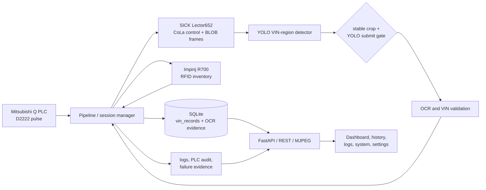
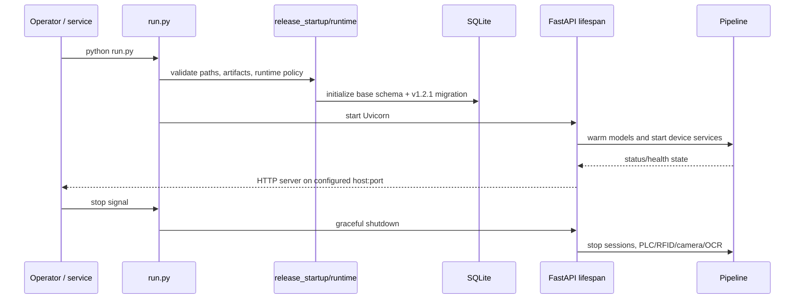
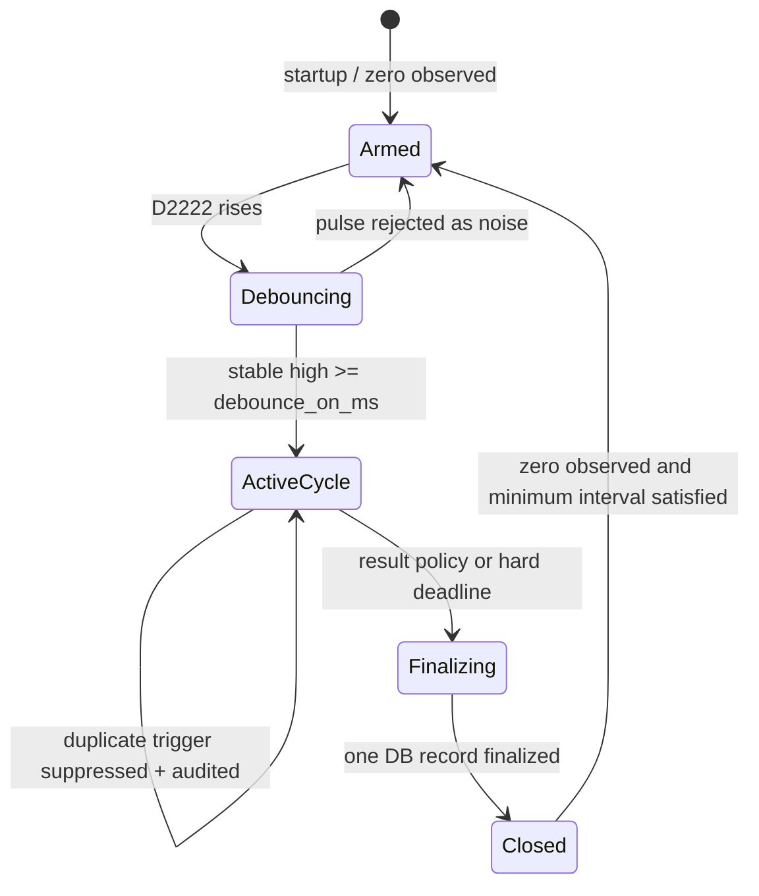
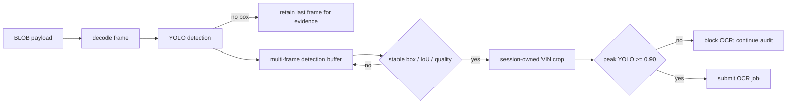
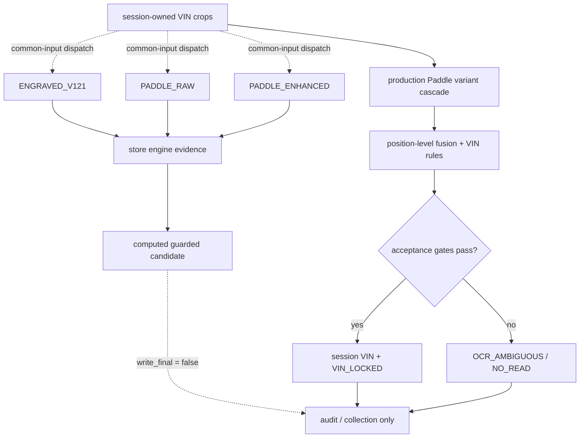
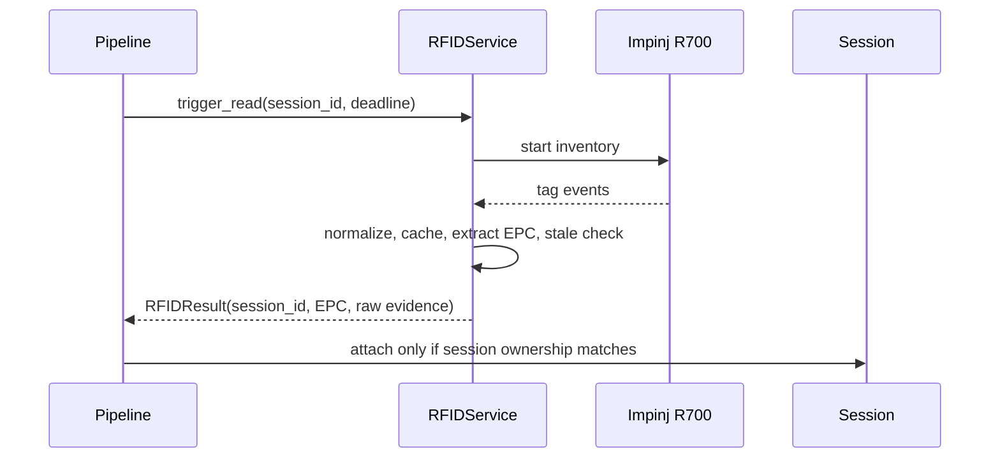
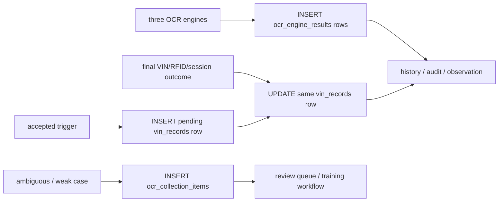
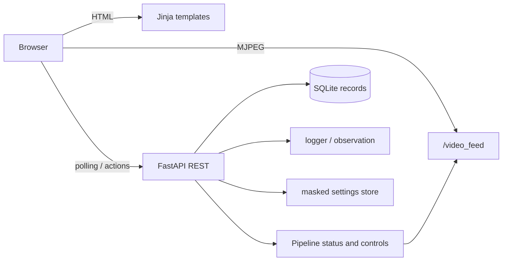
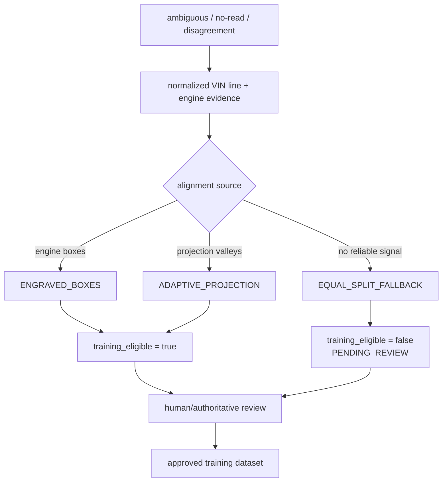

# AI_CAM v1.2.1 Production Stabilization
## Code Architecture Analysis

**Document status:** documentation build  
**Scope:** the repository in this release tree; no production code was changed  
**Audience:** developers, controls engineers, production support, and technical managers  
**Version source:** `VERSION` (`1.2.1`) and `README.md`

---

## 1. Executive overview

AI_CAM is an industrial VIN-reading and traceability service for Station 509. One accepted Mitsubishi PLC arrival pulse opens one body-cycle. During that cycle, the system reads an engraved VIN from a SICK Lector camera and reads an RFID EPC from an Impinj R700 in parallel. The vision path detects the VIN region with a local YOLO model, runs OCR, validates the 17-character result, and preserves per-engine evidence. The session manager then finalizes one SQLite record and exposes the live state and history through a FastAPI web application.

The dominant architectural invariant is:

> **one accepted PLC trigger → one session-owned body-cycle → one finalized production record**

The stabilization work adds explicit session ownership, trigger suppression, OCR retry closure, failure evidence, per-engine OCR storage, and production-observation artifacts around that invariant.

### What the system is, in one view

## 2. Source-of-truth hierarchy

The repository contains documents from several hardening baselines. For current behavior, use this order:

1. `config/settings.yaml` for deployment values that it explicitly supplies.
2. Typed defaults and validation in `backend/config.py` for values omitted from YAML.
3. Runtime behavior in `backend/pipeline.py`, `backend/server.py`, and device/OCR modules.
4. Current tests as executable contracts.
5. `README.md`, `CHANGELOG.md`, and the v1.2.1 reports for intended release framing.
6. Older documents marked v1.1.3 or earlier as historical context only.

This precedence matters for OCR mode. `config/settings.yaml` currently sets `ocr_release.release_mode: GUARDED_PRIMARY`, while `RELEASE_NOTES_v1.2.1.md` and portions of `README.md` describe `SHADOW` as the safe release baseline. More importantly, the live call graph dispatches the three-engine stage with `write_final=False`; the accepted session VIN still comes from `OCRWorker`'s process-isolated Paddle variant fusion. The YAML value changes the candidate computed inside the evidence stage, but that candidate is not propagated into the body-cycle decision. Documentation must therefore distinguish **configured orchestration mode** from **actual production authority**.

## 3. Repository structure

| Area | Responsibility | Principal files |
|---|---|---|
| Launcher and readiness | CLI parsing, release gates, DB preparation, Uvicorn lifecycle | `run.py`, `backend/release_startup.py`, `backend/runtime.py` |
| Session orchestration | PLC-triggered body-cycle, camera ownership, detection/OCR/RFID coordination, finalization | `backend/pipeline.py` |
| PLC | MELSEC transport, D2222 polling, edge interpretation, debounce/audit, simulator | `backend/plc/plc_service.py`, `plc_melsec.py`, `edge_audit.py` |
| Camera | SICK Lector652 CoLa control, BLOB stream parsing, reconnect and payload decoding | `backend/camera/camera_client.py` |
| Detection | Local YOLO model load, device resolution, boxes and crops | `backend/ai/detector.py`, `models/yolo/best.pt` |
| Legacy OCR/fusion | Paddle variant execution, multi-crop fusion, VIN rules and retry handling | `backend/ai/ocr_worker.py`, `vin_fusion.py`, `vin_rules.py`, `ocr_retry_guard.py` |
| Three-engine evidence | Engraved classifier, independent Paddle profiles, orchestration, disagreement audit | `backend/ai/ocr_orchestrator.py`, `ocr_shadow_stage.py`, `engines/` |
| Active learning | uncertain-case collection, alignment metadata, review tooling | `backend/ai/ocr_collector.py`, `dataset_collector.py`, `tools/build_collection_review_queue.py` |
| RFID | session-owned read service, R700 REST/stream clients, EPC extraction/cache | `backend/rfid/` |
| Persistence | one production record per session, OCR evidence rows, schema migrations | `backend/database/db.py`, `ocr_v121_db.py`, `migrations/` |
| Web/API | authentication, HTML pages, REST status/history/settings/logs, MJPEG | `backend/server.py`, `backend/auth.py` |
| Frontend | operator dashboard, history, settings, logs, system-health views | `frontend/templates/`, `frontend/static/` |
| Operations | preflight, observation, backup/restore, deployment scripts | `tools/`, `scripts/`, `deploy/`, `docs/UBUNTU_26_*` |

## 4. Runtime entry and lifecycle

`run.py` is the supported entry point. A normal start prepares the release environment, validates paths and model artifacts, initializes/migrates the SQLite database, and starts `backend.server:app` under Uvicorn. The FastAPI lifespan establishes the security policy and runtime readiness checks, warms or starts the pipeline services, and shuts them down in a controlled order.

Release utilities intentionally separate readiness levels:

- `run.py --self-check` validates paths, imports, artifacts, hashes, and contracts without starting hardware.
- `run.py --dry-run` adds clean-DB migration checks and local-model smoke inference without starting production devices.
- `tools/observe_production.py` gathers real runtime artifacts and refuses to call a partial window complete.

## 5. PLC trigger lifecycle

The configured production integration is a Mitsubishi Q-series PLC at `10.123.40.99:5003`, using MELSEC-compatible access and D2222 bit 0 as the arrival signal. `PLCService` polls the configured address, interprets the word according to `signal_kind`, debounces transitions, and calls the pipeline on an accepted rising edge.

Important behaviors:

- `require_zero_before_rearm: true` prevents a held signal from repeatedly opening sessions.
- Production queueing is disabled by `pending_trigger_queue_enabled: false`.
- A trigger during an active cycle is audited and suppressed, not queued.
- A trigger earlier than `minimum_body_interval_sec` (90 seconds in the tracked configuration) is treated as suspicious and suppressed.
- The falling edge closes the PLC pulse, not necessarily the body-cycle. The session continues until result/deadline policy finalizes it.
- The DONE register is blank in the tracked configuration, so no physical completion register should be claimed or invented.
- PLC edge and suppressed-trigger artifacts are written under `runtime/audit/`.

## 6. Camera and YOLO pipeline

`Lector652Client` controls the camera over CoLa-A and receives image payloads through a BLOB socket. The tracked endpoint uses port 2111 for control and 2113 for BLOB data. The client includes framed payload parsing, BMP/raw-gray decoding, receive timeouts, and reconnection handling.

The pipeline separates capture from inference:

1. The session becomes the capture owner.
2. The camera loop receives and decodes frames.
3. The inference loop calls `PlateDetector.detect()`.
4. Detection boxes are buffered and assessed for stability.
5. Candidate crops are expanded by a margin and scored for quality.
6. OCR submission requires stable, session-owned evidence.

`PlateDetector` loads the project-local `models/yolo/best.pt` model and resolves CPU/GPU execution from configuration and runtime availability. The general detector threshold in the tracked YAML is 0.4; the stricter OCR submit threshold comes from the typed `ocr_submit_min_yolo_conf` default of 0.90 in `backend/config.py`. Crop quality cannot override this detector-confidence gate.

## 7. OCR pipeline and engine orchestration

The repository contains two related but currently separate layers:

- The production/legacy Paddle path in `ocr_worker.py`, which builds preprocessing variants, runs independent reads, fuses multiple crops/variants, applies VIN rules, and emits the accepted or ambiguous result.
- The v1.2.1 three-engine evidence layer, which sends the same session-owned crop to `ENGRAVED_V121`, `PADDLE_RAW`, and `PADDLE_ENHANCED`, stores the outputs separately, and computes a configured candidate without writing it into the live session.

### Model roles

| Engine | Input and role | Key guard |
|---|---|---|
| `ENGRAVED_V121` | Project-local ONNX/PT engraved-character model; adaptive segmentation and per-character evidence | evidence-stage candidate only in the current integration |
| `PADDLE_RAW` | Independent Paddle invocation on a raw or minimally normalized crop | evidence-stage validator; stored separately |
| `PADDLE_ENHANCED` | Independent Paddle invocation after documented contrast enhancement | evidence-stage validator; stored separately |
| Production Paddle fusion | Multiple crops, preprocessing variants, rotations, position-level voting, and VIN structure rules | **current live session authority** |

### Decision flow

The three-engine orchestrator never constructs a character-by-character hybrid that no engine produced. The production Paddle fusion is different: it performs weighted position-level voting and can apply configured rule-constrained corrections, including fixed characters at model-independent positions. Raw OCR is retained, so the accurate claim is **auditable correction**, not literal “no substitution.”

### Known character risks

`backend/ai/ocr_disagreement.py` implements helpers for `E/F`, `U/V`, `V/J`, `0/6`, `6/8`, and `0/8` disagreement and a proposed weak-position corroboration rule. Repository search finds production call sites only in tests, not in the live acceptance path. The live production path instead relies on fusion score, independent crop/evidence grouping, risky-position margins, raw support, known-model structure, and exact-conflict gates. Slides should describe the F/E and U/V helpers as implemented/tested utilities pending runtime integration.

### Retry closure

The retry guard permits another expensive OCR pass only when evidence materially changes: a new frame hash, improved detector confidence, improved crop quality, changed box, new engine result, or improved decision margin. Once the session accepts a VIN, `VIN_LOCKED` makes the final value immutable and cancels further retries. Late outputs remain evidence, not a second production decision.

## 8. RFID lifecycle

`RFIDService` starts a session-owned read in parallel with camera processing. In R700 mode, the service uses the REST/stream integration to start inventory, apply configured antenna ports and transmit power, normalize events, reject stale results, extract the EPC/body identifier, and return an `RFIDResult` carrying the originating session ID.

The tracked configuration enables four antenna ports and validates the derived decimal EPC against a configured range. These are deployment values, not universal R700 limits.

## 9. Session and finalization logic

`Pipeline` owns a dictionary of `Session` objects and one active/capture owner. A session tracks trigger sequence, monotonic deadlines, state, VIN result, RFID result, evidence paths, frame/detection counts, OCR status, and timing telemetry.

The current tracked policy uses a 30-second body-cycle window and requires RFID for success. Finalization:

1. validates the session identity and terminal state;
2. determines success/failure and failure reason;
3. preserves best crop or last frame when decoded evidence exists but no VIN is available;
4. updates the single pending `vin_records` row;
5. releases capture ownership and exposes the result through status/history.

Decoded failures have an explicit evidence invariant:

> decoded frames > 0 and no final VIN ⇒ a failure-evidence image path must be stored

A missed capture with no payload cannot produce an image; in that case, the PLC edge history and trigger metadata are the evidence.

## 10. Database structure and storage flow

The canonical database is `runtime/data/ai_cam.db`.

### Core record

`vin_records` is the one-row-per-session production table. It includes:

- identity: `session_id`, trigger sequence, timestamps;
- result: validated VIN, raw VIN, model, confidence, status;
- traceability: RFID EPC and raw EPC;
- evidence: image path and failure reason;
- performance: OCR, RFID, and total-session latency;
- additive v1.2.1 final-OCR fields.

`session_id` is unique. A pending row is inserted at session start and updated at finalization; this avoids creating separate “start” and “finish” records.

### OCR evidence

`ocr_engine_results` stores one row per engine per session, including raw/gated text, native payloads, per-character data, boxes, preprocessing profile, model identity/checksum, latency, status, and errors.

`ocr_collection_items` stores active-learning metadata for reviewable character samples.

## 11. Frontend and API architecture

The web layer is server-rendered HTML plus plain JavaScript. FastAPI serves:

- `/dashboard`: device status, live MJPEG stream, PLC controls, current VIN, and counters;
- `/history`: searchable/filterable VIN/RFID records, confidence/status, image preview, CSV/XLSX export;
- `/logs`: recent/search/stream/stats/download/clear operations with authorization controls;
- `/system`: backend service health and architecture summary;
- `/settings`: masked settings read/write and defaults;
- `/health`, `/api/status`, and `/api/metrics`: readiness and monitoring data.

The dashboard and history use single polling owners with visibility/unload cleanup to prevent duplicate timers. Authentication middleware protects all non-public pages/API routes, and settings secrets are masked on readback.

## 12. Dataset collector architecture

There are two collection paths:

1. YOLO auto-collection (`dataset_collector.py`) saves qualifying full frames plus YOLO-format boxes through a bounded background queue.
2. OCR v1.2.1 collection captures ambiguous/no-read/weak-character evidence with per-character alignment and review metadata.

Equal-width splitting is unsafe because perspective, engraving spacing, padding, and glyph width make `width / 17` cuts cross character strokes. The fallback is retained for diagnostics but is explicitly blocked from production training eligibility.

## 13. Observation and logging architecture

Operational evidence is intentionally split by purpose:

- application logs and UI log stream: `runtime/logs/`;
- PLC edge timelines and suppressed triggers: `runtime/audit/`;
- successful/failed image evidence: `runtime/crops/`;
- OCR active-learning samples: `runtime/engraved_ocr_collection/`;
- production/session records: SQLite;
- observation reports: `reports/PRODUCTION_24H_*`.

`tools/observe_production.py` aggregates these sources. It declares a run incomplete if the requested real observation window has not elapsed. The documented readiness gate expects zero duplicate production records, zero queued production triggers, no missing image evidence when frames decoded, and no equal-split sample marked training-eligible.

## 14. Failure modes and reliability controls

| Failure or risk | Current control | Residual concern |
|---|---|---|
| Duplicate or bouncing PLC pulse | debounce, active-cycle suppression, 90-second early-trigger audit | requires live ladder/pulse validation |
| Stuck-high trigger | zero-before-rearm | live PLC behavior still needs HIL |
| Camera timeout/disconnect | watchdog, reconnect loop, stale-frame checks | exact camera payload/lighting remains site-dependent |
| Weak/unstable detection | multi-frame buffer, quality checks, strict OCR submit gate | threshold may trade recall for precision |
| OCR disagreement | production Paddle fusion preserves raw evidence; parallel engines add audit rows | specific weak-position helpers are not wired to live acceptance |
| Repeating OCR on same evidence | evidence signature and retry guard | improvements depend on genuinely new frames |
| Late result attached to wrong body | explicit session ownership and stale-result rejection | cross-device clock/latency must be observed live |
| Duplicate database row | unique `session_id`, pending-row update | restart recovery policy must remain tested |
| No VIN but decoded frames | best-crop/last-frame failure evidence | storage retention and disk pressure |
| Dataset label corruption | alignment source metadata and manual review | review queue requires operational ownership |
| Frontend polling multiplication | single polling owner and lifecycle cleanup | browser/network degradation still affects freshness |

## 15. Strengths

- A clear session-ownership model ties PLC, camera, OCR, RFID, evidence, and DB state to one body.
- Device and model artifacts are project-local and portable.
- OCR evidence is preserved by engine instead of flattened into one unexplained string.
- Retry suppression and VIN locking bound expensive work and prevent late mutation.
- Failure cases are treated as learning and audit inputs.
- Frontend/API, persistence, and observation layers expose the same underlying session state.
- The repository includes extensive offline contracts for session, PLC, camera, OCR, DB, security, and frontend behavior.

## 16. Known technical risks and improvement opportunities

1. **Reconcile OCR authority.** The tracked YAML selects `GUARDED_PRIMARY`, but the three-engine hook calls `write_final=False` and production binding remains in `OCRWorker`. Either promote the guarded candidate through an explicit validated rollout or rename/configure the stage as evidence-only so operators are not misled.
2. **Use accurate correction language.** Production fusion can enforce configured fixed positions. Preserve raw-versus-final deltas and describe the result as rule-constrained correction, not “a character is never invented.”
3. **Integrate weak-position helpers deliberately.** F/E and U/V corroboration utilities are tested but are not called by the live decision path.
4. **Complete live site validation.** Offline tests cannot validate PLC ladder timing, camera exposure/geometry, RFID field behavior, or GPU driver/runtime compatibility.
5. **Capture hardware identity.** The repository identifies Lector652, Mitsubishi Q family, and R700, but not the PLC CPU module, exact camera ordering variant/optics, or installed GPU SKU. Store signed commissioning inventory outside secrets.
6. **Use production screenshots after authorization.** This release contains no runtime images or database. Add sanitized, approved examples to a separate documentation asset pack instead of committing operational data blindly.
7. **Make decision authority visibly observable.** Dashboard/system health should expose the production VIN authority, evidence-stage mode, detector gate, model checksum/version, and collection eligibility rules.
8. **Close the active-learning loop.** Define ownership, review SLA, authoritative label source, dataset versioning, train/evaluate criteria, and controlled deployment/rollback. The current live loop is a review-candidate generator, not an automatic training-data generator.
9. **Preserve storage headroom.** Failure images, engine payloads, and collection items increase forensic value but require retention monitoring and tested backup/restore.
10. **Reduce historical-document ambiguity.** Version or archive older v1.1.3 architecture/config documents so new operators do not treat them as current deployment truth.
11. **Fix the Logs clear CSRF contract.** The browser action does not send the backend-required `X-CSRF-Token`; with tracked CSRF enabled, clearing should fail with 403.
12. **Qualify History KPIs.** The page computes summary cards from a maximum 150-row fetch, while export uses the full filtered result. Do not present those cards as all-time totals without pagination/server aggregation.
13. **Make System navigation and content live.** `/system` is not linked from the inspected main navigation and its architecture description is static, so it can drift from effective runtime configuration.

## 17. Maintainability and scalability notes

- The current single-station, SQLite-centered architecture is appropriate for a local edge service and keeps the PLC-to-record invariant simple.
- Device adapters and simulator modes provide useful isolation for testing.
- `Pipeline` carries a large amount of orchestration responsibility. If the system expands to multiple stations, formal event/state boundaries and per-station instances should be introduced before horizontal scaling.
- SQLite is suitable for local traceability and export. A central historian integration should consume finalized events asynchronously rather than weakening local finalization.
- Model promotion should remain checksum/versioned and guarded by an evaluation + rollback contract.

## 18. Verification boundary

This analysis is based on repository source, tracked configuration, tests, and existing release reports. It does **not** claim that live PLC, camera, R700, or GPU behavior has been verified in the production cell. The existing consolidation report explicitly marks hardware validation as pending, and the 24-hour observation document forbids declaring completion from mocked or partial evidence.
