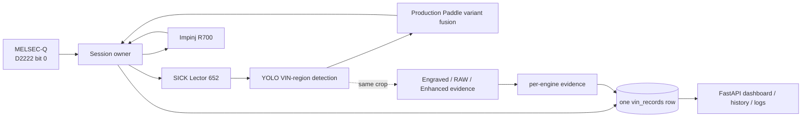

# AI_CAM v1.2.1 Production Stabilization
## Executive Summary

AI_CAM is a Station 509 industrial VIN-reading and traceability service. A Mitsubishi MELSEC-Q D2222 arrival pulse opens one body-cycle. The system starts SICK Lector camera capture and Impinj R700 RFID inventory in parallel, locates the engraved VIN region with YOLO, reads and validates the VIN, binds the visual and RFID evidence to the same session, and finalizes one SQLite production record.

## Operational value

- **Traceability:** the PLC event, VIN, RFID EPC, status, timing, and image evidence share one session identity.
- **Early mismatch visibility:** an operator can compare physical VIN evidence with electronic tag evidence before the information is lost downstream.
- **Less manual reconstruction:** dashboard, history, exports, logs, and retained failure images put the evidence in one place.
- **Controlled failure behavior:** duplicate/early triggers, stale RFID results, ambiguous OCR, late results, and missed evidence paths produce explicit outcomes instead of silent second records.
- **A model-improvement path:** uncertain cases can become human-reviewable collection candidates.

## Architecture at a glance

## AI and OCR: the accurate current-state description

The production VIN authority is the process-isolated PaddleOCR variant cascade in `backend/ai/ocr_worker.py`. It evaluates multiple crops and preprocessing variants, groups near-duplicate evidence, performs weighted position-level fusion, applies known-model VIN rules, and enforces score, margin, raw-support, position, and conflict gates.

In parallel, AI_CAM runs `ENGRAVED_V121`, `PADDLE_RAW`, and `PADDLE_ENHANCED` on the same session-owned crop. That stage preserves per-engine text, confidence, boxes, payloads, model identity, latency, status, and errors. Although the tracked YAML says `GUARDED_PRIMARY`, the live hook calls the stage with `write_final=False`; its computed candidate is evidence-only and does not currently replace the session VIN.

Two wording rules follow from the implementation:

1. Describe the three-engine stage as an **evidence and active-learning layer**, not the current production authority.
2. Describe production output as **auditable, rule-constrained correction**, not literal “no substitution,” because configured fixed VIN positions can be enforced while raw OCR remains stored.

## Hardware summary

| Layer | Identified family | Verified capability used in this package | Important boundary |
|---|---|---|---|
| Vision | SICK Lector 652 | 2.1 MP monochrome sensor, 2,048 × 1,088, up to 70 Hz, GigE/IP65 family | exact ordering suffix, optics, illumination, and firmware unknown |
| PLC | Mitsubishi MELSEC-Q | MC protocol device-memory access; D word register; Type3E integration | exact CPU/Ethernet module and live port/ladder proof pending |
| RFID | Impinj R700 | four antenna ports; ISO 18000-63; REST + HTTP streaming; up to 1,100 reads/s | regional SKU, firmware, antennas, RF field, and legal power setting pending |
| Compute | NVIDIA target | YOLO/Paddle CUDA path with runtime probes and safe CPU fallback | installed GPU SKU and simultaneous Torch/Paddle CUDA readiness unresolved |

## Stabilization controls

- D2222 edge debounce, pulse-width audit, duplicate suppression, and suspicious-early-trigger evidence.
- No production pending-trigger queue.
- Session and capture ownership to prevent late results from attaching to another body.
- Strict peak-YOLO OCR submit gate of 0.90.
- New-evidence-only OCR retry and `VIN_LOCKED` after acceptance.
- One pending database row updated at finalization under a unique `session_id`.
- Failure images when frames decoded but no VIN was produced.
- Production-observation tooling that refuses to call a partial window complete.

## Readiness assessment

The documentation and presentation package is ready for a management + engineering review. It is grounded in source, tracked configuration, focused test evidence, and official device documentation.

Live production validation remains pending:

1. record exact camera, PLC, R700, antenna, network, and GPU identities;
2. confirm D2222 pulse/port/ladder behavior in HIL;
3. verify camera exposure, optics, and representative engraved VIN capture;
4. validate R700 region, power source, RF field, stale/adjacent-body behavior;
5. record Torch and Paddle CUDA readiness and sustained latency;
6. align the configured three-engine release mode with its evidence-only integration;
7. complete the real 24-hour observation window.

**DOCUMENTATION PACKAGE READY**

