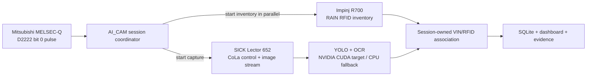

# AI_CAM v1.2.1 Hardware Capability Report

**Project:** AI_CAM v1.2.1 Production Stabilization  
**Deployment context:** Station 509 industrial VIN capture and traceability  
**Evidence cut-off:** 29 July 2026  
**Audience:** Engineering and technical stakeholders

## Technical summary

The repository identifies three production device families with high confidence:

1. **SICK Lector 652** image-based code reader/camera.
2. **Mitsubishi Electric MELSEC-Q series** PLC.
3. **Impinj R700** RAIN RFID reader.

The repository also targets an **NVIDIA CUDA GPU**, but it does not preserve the installed GPU's exact model. `GTX 1650` is presented only as an example. Existing release evidence explicitly says that live camera, PLC, and R700 tests were not run, and that NVIDIA hardware was detected while the pinned Torch/Paddle environment used CPU fallback. Therefore this report separates:

- **Repository-proven integration facts**: names, IP addresses, ports, protocols, register, configured timing, and code paths.
- **Manufacturer-verified capabilities**: capabilities that apply to the identified product family.
- **Unresolved facts**: exact ordering suffixes, serial numbers, firmware, regional variants, attached optics/antennas, and the installed GPU SKU.

The hardware topology is clear enough for documentation and presentation use, but it is **not a substitute for a live hardware acceptance test**.

## Slide-ready hardware summary

| Hardware | Evidence-backed identifier | Role in AI_CAM | Relevant verified capability | AI_CAM integration point | Identification confidence |
|---|---|---|---|---|---|
| Industrial vision device | **SICK Lector 652**; manufacturer family code **V2D652R-\***, exact suffix unknown | Supplies monochrome body/VIN imagery for YOLO detection and OCR | 2.1 MP CMOS sensor, 2,048 × 1,088; up to 70 Hz; Gigabit Ethernet; IP65 family enclosure | `10.123.86.42`; CoLa-A control `2111/tcp`; project BLOB image stream `2113/tcp`; `Lector652Client` → `Pipeline` | **High** for family; **medium** for exact variant |
| Line controller | **Mitsubishi Electric MELSEC-Q series**; `plc_type: Q`; exact CPU/Ethernet module unknown | Opens one AI_CAM body cycle from the D2222 arrival pulse | MC protocol permits an external device to read/write PLC device memory; `D` is a word data-register device; 3E-frame batch read/write is supported by relevant Q-series interfaces | `10.123.40.99:5003`; Type3E client; reads D2222 as a word, evaluates bit 0, polls every 100 ms | **High** for series and register; **low** for exact module |
| RFID reader | **Impinj R700 RAIN RFID reader**; regional SKU and hardware revision unknown | Reads a body-associated EPC in parallel with camera capture and binds it to the same session | Four antenna ports; GS1 UHF Gen2v2 / ISO 18000-63; up to 1,100 reads/s; REST configuration API and HTTP streaming; Gigabit Ethernet | `10.123.18.3:80`; `/api/v1` REST profiles + `/api/v1/data/stream`; ports 1–4; strongest valid in-window RSSI selected | **High** for family; **medium** for exact variant |
| Edge inference accelerator | **NVIDIA GPU**, exact model unknown; `GTX 1650` is only an example in the README | Intended to accelerate YOLO and Paddle-based OCR on `cuda:0` | No installed-device specification can be asserted. If the deployment is actually a desktop GTX 1650, NVIDIA lists 896 CUDA cores and 4 GB GDDR5/GDDR6, but this is contextual only | `nvidia-smi` discovery; Torch/Paddle runtime probes; detection device `cuda:0`; safe CPU fallback | **Medium** for NVIDIA presence; **unresolved** for model and GPU-ready runtime |

## 1. SICK Lector 652 industrial vision device

### Repository identification and role

The device name is repeated in the camera client, frontend system view, deployment network guide, and training guide. The canonical configuration assigns:

- IP address: `10.123.86.42`
- CoLa-A control port: `2111/tcp`
- BLOB image port: `2113/tcp`
- Effective image size seen in the project capture workflow: `800 × 440`

Primary repository evidence:

- [`config/settings.yaml`](../config/settings.yaml) — deployment endpoint and camera timing.
- [`backend/camera/camera_client.py`](../backend/camera/camera_client.py) — `Lector652Client`, CoLa handshake, strict BLOB framing, effective-image-size query, and frame decoding.
- [`backend/pipeline.py`](../backend/pipeline.py) — camera connection, capture thread, watchdog/reconnect, frame decoding, and handoff to detection.
- [`TRAINING_GUIDE.md`](../TRAINING_GUIDE.md) — the `800 × 440` effective capture geometry used for dataset guidance.

The application opens a TCP control socket, authenticates with a redacted CoLa `CheckPassword` command, queries device identity and effective image size, enables BLOB transfer, opens a second image socket, and starts live acquisition. Frames are decoded without rotation and handed to the decoupled capture/inference pipeline.

### Manufacturer-verified capabilities

SICK's current Lector64x/Lector65x operating instructions identify the Lector 652 as product pattern **V2D652R-Mxxxxx** and specify a monochrome CMOS matrix sensor with **2.1 megapixels (2,048 × 1,088)**. The same manual lists **70 Hz** for the 2.1 MP Lector65x, Gigabit Ethernet connectivity, IP65 enclosure protection, 0 °C to +50 °C operation, and support for image/data storage. See the official [SICK Lector64x/Lector65x operating instructions](https://cdn.sick.com/media/docs/3/53/453/operating_instructions_lector64x_65x_flex_lector65x_dynamic_focus_fr_im0071453.pdf).

SICK's English parameter reference says the Ethernet AUX interface is normally used for configuration and analysis and that its default IP port is **2111**, which supports the repository's control-port choice. See the official [SICK Lector63x/Lector64x/Lector65x online help](https://www.sick.com/media/docs/4/34/534/online_help_lector63x_lector64x_lector65x_en_im0077534.pdf).

### Why the capability matters in AI_CAM

- The native sensor resolution provides more source detail than the current `800 × 440` effective stream, leaving room for optical/configuration tuning if the present crop lacks character detail.
- A 70 Hz acquisition ceiling is well above AI_CAM's current dashboard stream rate and supports multi-frame crop selection; actual end-to-end inference speed will be lower and depends on exposure, network transfer, decoding, and AI workload.
- Gigabit Ethernet and industrial enclosure protection fit a fixed production-station deployment.
- The project's separate control and image sockets allow device commands and frame delivery to be handled independently.

### Confidence and unresolved details

- **Confirmed:** Lector 652 family, endpoint, CoLa port, project BLOB port, and the code-level integration.
- **Not identified:** full `V2D652R-...` ordering designation, serial number, Flex versus Dynamic Focus, lens focal length, illumination module/color, protective-window material, firmware, and physical mounting distance.
- **Important distinction:** `800 × 440` is the **effective project capture size**, not the manufacturer's native sensor resolution.
- **Evidence boundary:** port `2113` and the BLOB framing are strongly evidenced by the working repository implementation, but this research did not locate a public SICK document that defines that private/project-specific stream contract.
- **Live validation:** the repository's release reports state that the production camera was not reached or exercised from the validation host.

## 2. Mitsubishi Electric MELSEC-Q series PLC

### Repository identification and role

The canonical configuration identifies a Mitsubishi Q-series PLC using:

- IP address and port: `10.123.40.99:5003`
- Mode: `melsec`
- Library type selector: `plc_type: Q`
- Arrival register: `D2222`
- Trigger interpretation: word **bit 0**
- Trigger mode: rising pulse, expected width 2,000–4,500 ms
- Polling interval: 100 ms
- D2223: not used

Primary repository evidence:

- [`config/settings.yaml`](../config/settings.yaml) — endpoint, D2222 interpretation, debounce, pulse-width audit, and rearm policy.
- [`backend/plc/plc_melsec.py`](../backend/plc/plc_melsec.py) — `pymcprotocol.Type3E`, word/bit device selection, batch read, optional write, and reconnect behavior.
- [`backend/plc/plc_service.py`](../backend/plc/plc_service.py) — polling, edge detection, debounce, startup recovery, rearm, and session callback.
- [`docs/PLC_AND_CONFIG.md`](../docs/PLC_AND_CONFIG.md) — D2222-only operating contract and warning against comparing an entire data word blindly with `1`.

`D2222` begins one body cycle. The application reads it as a **word device**, then extracts bit 0 in software. A debounced rising edge opens the session, and camera capture and RFID inventory begin in parallel. The pulse falling edge rearms the trigger; it does not prematurely close the session.

### Manufacturer-verified capabilities

Mitsubishi Electric's official MC protocol manual states that an external device can communicate with supported controllers by implementing MC protocol message procedures. It identifies Q-series Ethernet interface modules such as **QJ71E71-100**, **QJ71E71-B5**, and **QJ71E71-B2**, defines `D` as a decimal **word data register**, and documents **3E-frame** batch reads and writes. See the official [MELSEC Communication Protocol Reference Manual](https://www.mitsubishielectric.com/dl/fa/document/manual/plc/sh080008/sh080008ab.pdf).

These capabilities match AI_CAM's use of a Type3E client and a one-word read of D2222. They do **not** prove which QCPU or Ethernet module is physically installed at Station 509.

### Why the capability matters in AI_CAM

- Device-memory reads let AI_CAM observe the line trigger without modifying the PLC program's fundamental control role.
- Reading the D register as a word and masking bit 0 prevents unrelated bits in D2222 from producing false state changes.
- The 100 ms polling and 200 ms debounce settings provide a documented balance between response time and noise rejection.
- The PLC is the authoritative cycle boundary: one accepted D2222 pulse maps to one session and one final database record.

### Confidence and unresolved details

- **Confirmed:** MELSEC-Q family, `Q` protocol selector, endpoint, D2222, bit-0 interpretation, Type3E client, and one-word read.
- **Not identified:** exact CPU model, Ethernet module, station/network addressing, firmware, configured MC frame format on the PLC side, and the physical sensor or ladder logic that drives D2222.
- **Deployment-specific port:** `5003` is a configured listener port, not a universal MELSEC-Q port.
- **Documentation drift:** the header comment in `backend/plc/plc_melsec.py` mentions TCP `5004`, while canonical configuration, code construction, tests, README, and network documentation use `5003`. Runtime code uses the configured value; presentation material should show **5003** and note that it must be confirmed on site.
- **Write path:** the code can write a DONE/handshake device, but the canonical `done_address` is empty. No active PLC acknowledgment register should be claimed.

## 3. Impinj R700 RAIN RFID reader

### Repository identification and role

The canonical configuration identifies an Impinj R700 using:

- IP address and port: `10.123.18.3:80`
- Reader mode: `r700`
- Antenna ports: `1, 2, 3, 4`
- Configured transmit power: `3150 cdbm` = **31.50 dBm**
- First inventory window: 6,000 ms
- Retry delay/window: 2,000 ms / 4,000 ms, repeated to the session deadline
- Session deadline: 30 s
- Factory EPC extraction range: decimal `1000–9999`

Primary repository evidence:

- [`config/settings.yaml`](../config/settings.yaml) — endpoint, antennas, transmit power, inventory timing, and EPC validation.
- [`backend/rfid/r700_client.py`](../backend/rfid/r700_client.py) — `/api/v1` REST profile/preset management and transient inventory.
- [`backend/rfid/r700_stream.py`](../backend/rfid/r700_stream.py) — `/api/v1/data/stream` HTTP event stream and `tagInventory` parsing.
- [`backend/rfid/rfid_reader.py`](../backend/rfid/rfid_reader.py) — preset initialization, four-port normalization, RF parameter consistency, inventory windows, and tag selection.
- [`backend/rfid/tag_cache.py`](../backend/rfid/tag_cache.py) — thread-safe cache and strongest-RSSI selection inside the session window.
- [`backend/rfid/rfid_service.py`](../backend/rfid/rfid_service.py) — non-blocking session-owned read worker, retries, and explicit `NO_TAG`/`NO_READ` outcomes.

The service listens continuously for reader events. On a PLC trigger, it starts or activates an inventory profile in a separate thread, limits accepted observations to the current session window, filters EPCs through the configured factory rule, and selects the valid hit with the strongest RSSI.

### Manufacturer-verified capabilities

Impinj specifies the R700 as a **four-port RAIN RFID reader** compliant with **EPCglobal UHF Class 1 Gen 2 / ISO 18000-63**. The official datasheet lists four monostatic RP-TNC antenna ports, 10/100/1000BASE-T Ethernet, PoE/PoE+ power, typical receive sensitivity of -93 dBm under its stated test conditions, and a maximum read rate of **up to 1,100 reads per second** under qualifying configurations. It also lists an OpenAPI-compatible REST configuration API. See the official [Impinj R700 Series datasheet](https://support.impinj.com/hc/article_attachments/31243539924371).

Impinj's IoT Device Interface documentation confirms that R700 supports inventory profiles and presets, REST configuration, and HTTP streaming. Its support material documents `/api/v1/data/stream`, and its protected-mode example documents transient inventory at `/profiles/inventory/start`. See [Impinj IoT Device Interface overview](https://support.impinj.com/article/32123172324755), [HTTP/HTTPS configuration](https://support.impinj.com/article/360017447560), and [transient inventory example](https://support.impinj.com/article/32170781585427).

### Why the capability matters in AI_CAM

- Four RF ports allow the reading zone to be shaped around the body path with multiple antennas.
- Event streaming gives AI_CAM EPC, antenna, and RSSI observations without blocking the camera/OCR path.
- A bounded session window plus RSSI ranking reduces, but cannot by itself eliminate, cross-body tag association risk.
- The R700 API supports the project's short-lived inventory profiles and retry strategy.

### Confidence and unresolved details

- **Confirmed:** R700 family, endpoint, API paths, four configured ports, session timing, transmit-power request, and code-level event processing.
- **Not identified:** exact regional SKU (`IPJ-R700-241`, `-341`, `-441`, or a revision-2 `-B` part), hardware revision, firmware/API version, configured regulatory region, reader-interface mode, antenna models/polarization/gain/placement, cables, PoE versus PoE+ source, and RF-site survey results.
- **Transmit-power boundary:** the repository requests 31.50 dBm. The R700's allowed maximum depends on region and PoE/PoE+ negotiation. The reader should enforce valid regional values, but site acceptance must confirm the configured region and power source before this setting is described as compliant.
- **Firmware/interface dependency:** the REST inventory endpoints require the Impinj IoT Device Interface rather than the LLRP interface. The physical reader's active interface and firmware must be checked.
- **Transport security:** the current code constructs `http://.../api/v1` URLs. Impinj supports HTTPS; production policy should decide whether the isolated factory network is sufficient or whether the client must be migrated to TLS. This report does not claim the present HTTP link is encrypted.

## 4. NVIDIA edge inference GPU

### Repository identification and role

The hardware table says **“NVIDIA (e.g. GTX 1650)”**. The phrase `e.g.` makes GTX 1650 an example, not an installed-device identifier. The canonical production profile requests:

- YOLO device: `cuda:0`
- Paddle OCR GPU use: enabled
- Runtime discovery: `nvidia-smi --query-gpu=name,driver_version,memory.total`
- Compute verification: separate Torch and Paddle CUDA probes
- Safe fallback: CPU when GPU runtime compatibility fails

Primary repository evidence:

- [`README.md`](../README.md) — NVIDIA GPU role and non-binding GTX 1650 example.
- [`config/settings.yaml`](../config/settings.yaml) — YOLO and OCR GPU requests.
- [`backend/runtime.py`](../backend/runtime.py) — exact GPU name/driver/memory discovery and deep compute probes.
- [`requirements-gpu.txt`](../requirements-gpu.txt) — CUDA 11.8 Torch/Paddle deployment profile.
- [`reports/FINAL_RELEASE_CONSOLIDATION_REPORT.md`](FINAL_RELEASE_CONSOLIDATION_REPORT.md) — NVIDIA hardware detected, but the pinned validation environment used CPU fallback.

### What can and cannot be verified

The available repository proves an NVIDIA-aware compute path, but it does not preserve the output containing the GPU's exact name, memory, driver, or successful CUDA inference. No installed-device FLOPS, VRAM, Tensor Core, or throughput claim is therefore justified.

For context only, NVIDIA's official comparison table lists both desktop GTX 1650 G5 and G6 reference configurations with **896 CUDA cores**, **4 GB** memory, a 128-bit memory interface, and 75 W reference graphics-card power. Those values should appear in a slide only if the site team first confirms that the installed card is actually a desktop GTX 1650 and identifies its board variant. See the official [NVIDIA GeForce comparison table](https://www.nvidia.com/en-us/geforce/graphics-cards/compare/).

### Why the capability matters in AI_CAM

- A working CUDA path can reduce latency for YOLO detection and Paddle-based OCR, preserving more of the 30-second body-cycle budget.
- AI_CAM deliberately probes the driver and both frameworks rather than assuming that visible hardware means a usable inference stack.
- CPU fallback preserves service availability, but its throughput and latency must be measured separately and should not be presented as equivalent to GPU operation.

### Confidence and unresolved details

- **Confirmed:** NVIDIA hardware was detected in one release validation context and the software has a CUDA-targeted execution path.
- **Not identified:** GPU model, board vendor, VRAM, driver version, advertised CUDA maximum, compute capability, host CPU/RAM/storage, thermals, and sustained inference throughput.
- **Not verified:** simultaneous Torch CUDA and Paddle CUDA readiness on the production Ubuntu host.
- **Required proof:** retain the output of `python run.py --self-check --require-gpu` and `nvidia-smi --query-gpu=name,driver_version,memory.total --format=csv` from the actual deployment host.

## 5. Cross-device integration implications

### Timing and ownership

AI_CAM treats the PLC pulse as the authoritative cycle start. RFID begins immediately in a non-blocking worker while camera capture starts in parallel. Both results carry session ownership before final database persistence. This architecture uses the complementary strengths of the hardware:

- The **PLC** provides deterministic line context.
- The **camera** provides high-information visual evidence.
- The **RFID reader** provides an independent electronic identity.
- The **GPU/compute host** transforms imagery into a validated VIN.

### Network dependencies

The documented Station 509 flows require these TCP paths from the AI_CAM host:

| Destination | Required flow | Purpose |
|---|---|---|
| `10.123.86.42:2111` | Host → Lector 652 | CoLa-A command/control |
| `10.123.86.42:2113` | Host ↔ Lector 652 | Project BLOB image stream |
| `10.123.40.99:5003` | Host ↔ MELSEC-Q | MC protocol device read; optional approved write path |
| `10.123.18.3:80` | Host ↔ Impinj R700 | REST configuration and HTTP event stream |

The repository does not identify the switch, VLAN, firewall, PoE/PoE+ injector, NIC, cable category, or time-synchronization source. Those are deployment dependencies, not verified hardware components.

## 6. Live validation checklist

Before the package uses the word **verified** for production hardware, capture the following:

1. **Lector 652**
   - Photograph the nameplate and record full product/serial number and firmware.
   - Save the `DeviceIdent` and `mDIGetEffImgSize` responses.
   - Confirm lens, illumination, exposure, working distance, and sustained frame rate.
   - Run a representative engraved-VIN capture and reconnect test.

2. **MELSEC-Q**
   - Record CPU and Ethernet-module model/firmware.
   - Confirm the MC listener is `5003`, frame format matches the Type3E client, and D2222 bit 0 is the approved arrival signal.
   - Capture a pulse trace proving debounce, width, rearm, and one-record-per-body behavior.
   - Keep the DONE write path disabled unless the controls owner assigns and approves a destination register.

3. **Impinj R700**
   - Record ordering part number, hardware revision, firmware/API version, regulatory region, and active reader interface.
   - Record antenna model, port mapping, gain/polarization, cable loss, mounting geometry, and PoE/PoE+ source.
   - Verify that 31.50 dBm is accepted and legal for the configured region/power mode.
   - Run adjacent-body and stale-tag tests to validate session association, not just raw read rate.

4. **NVIDIA host**
   - Save exact `nvidia-smi` output and the deep AI_CAM GPU self-check.
   - Measure YOLO and all OCR engine latency under sustained production load.
   - Monitor VRAM, temperature, power/clock throttling, and CPU fallback behavior.

## 7. Evidence quality and presentation rules

### Safe claims for the final presentation

- “AI_CAM integrates a SICK Lector 652, a Mitsubishi MELSEC-Q PLC, and an Impinj R700.”
- “The Lector 652 family uses a 2.1 MP monochrome sensor and supports up to 70 Hz acquisition.”
- “The R700 provides four RAIN RFID antenna ports and REST/HTTP-streaming integration.”
- “D2222 bit 0 is the configured body-arrival trigger, read through a Type3E MELSEC client.”
- “AI_CAM targets NVIDIA CUDA acceleration and safely falls back to CPU.”

### Claims to avoid until site evidence exists

- A full SICK ordering code, lens, illumination, or guaranteed `800 × 440` native resolution.
- A specific Mitsubishi CPU or Ethernet module.
- A specific R700 regional SKU, revision, firmware, antenna coverage, or compliant 31.50 dBm deployment.
- “The production GPU is a GTX 1650,” any GPU performance number, or “all engines run on CUDA.”
- “Live hardware validated” or “production-ready hardware verified.”

## Source inventory

### Repository sources

- [`README.md`](../README.md)
- [`config/settings.yaml`](../config/settings.yaml)
- [`backend/camera/camera_client.py`](../backend/camera/camera_client.py)
- [`backend/pipeline.py`](../backend/pipeline.py)
- [`backend/plc/plc_melsec.py`](../backend/plc/plc_melsec.py)
- [`backend/plc/plc_service.py`](../backend/plc/plc_service.py)
- [`backend/rfid/r700_client.py`](../backend/rfid/r700_client.py)
- [`backend/rfid/r700_stream.py`](../backend/rfid/r700_stream.py)
- [`backend/rfid/rfid_reader.py`](../backend/rfid/rfid_reader.py)
- [`backend/rfid/rfid_service.py`](../backend/rfid/rfid_service.py)
- [`backend/rfid/tag_cache.py`](../backend/rfid/tag_cache.py)
- [`backend/runtime.py`](../backend/runtime.py)
- [`docs/UBUNTU_26_NETWORK.md`](../docs/UBUNTU_26_NETWORK.md)
- [`reports/FINAL_PORTABLE_VALIDATION.md`](FINAL_PORTABLE_VALIDATION.md)
- [`reports/FINAL_RELEASE_CONSOLIDATION_REPORT.md`](FINAL_RELEASE_CONSOLIDATION_REPORT.md)

### Official manufacturer sources

- SICK: [Lector64x/Lector65x operating instructions](https://cdn.sick.com/media/docs/3/53/453/operating_instructions_lector64x_65x_flex_lector65x_dynamic_focus_fr_im0071453.pdf)
- SICK: [Lector63x/Lector64x/Lector65x online help](https://www.sick.com/media/docs/4/34/534/online_help_lector63x_lector64x_lector65x_en_im0077534.pdf)
- Mitsubishi Electric: [MELSEC Communication Protocol Reference Manual](https://www.mitsubishielectric.com/dl/fa/document/manual/plc/sh080008/sh080008ab.pdf)
- Impinj: [R700 Series RAIN RFID Readers datasheet](https://support.impinj.com/hc/article_attachments/31243539924371)
- Impinj: [IoT Device Interface overview](https://support.impinj.com/article/32123172324755)
- Impinj: [IoT Device Interface OpenAPI specifications](https://support.impinj.com/article/32195454977555)
- Impinj: [R700 HTTP/HTTPS and `/api/v1/data/stream`](https://support.impinj.com/article/360017447560)
- Impinj: [Transient inventory API example](https://support.impinj.com/article/32170781585427)
- NVIDIA: [GeForce GPU comparison table](https://www.nvidia.com/en-us/geforce/graphics-cards/compare/)

---

**Readiness statement:** Hardware identities and capabilities are documented for presentation use with explicit confidence boundaries. **Live Station 509 acceptance remains pending.**
