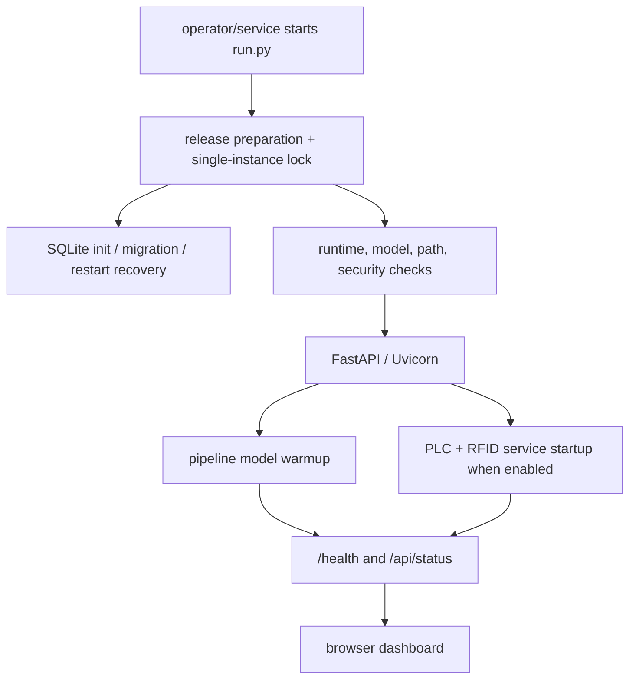

# AI_CAM v1.2.1 Operations and UI Analysis

**Scope:** operator-facing workflow, FastAPI surface, browser behavior, evidence access, and operational lifecycle  
**Evidence boundary:** static repository analysis; no live Station 509 browser session or production database was available. The local runtime database contains one `RESTART_RECOVERY` smoke row and zero OCR-engine rows, so it is not production evidence. The inspected runtime crop images are synthetic noise fixtures and are unsuitable for the presentation.

## 1. Operator experience in one sentence

AI_CAM gives an operator one web surface for device readiness, live VIN-region detection, current session status, historical VIN/RFID records, evidence images, logs, exports, settings, and system health.

The frontend is server-rendered Jinja HTML with plain JavaScript and CSS. It is not a separate SPA or desktop client. FastAPI serves both the pages and the REST/MJPEG endpoints from the same process (`backend/server.py`, `frontend/templates/`, `frontend/static/`).

## 2. Startup and readiness workflow

Normal source startup is `python run.py`.

The launcher supports software-only readiness modes:

- `--self-check`: paths, artifacts, imports, hashes, model contracts, runtime diagnostics;
- `--dry-run`: adds temporary DB/migration and real local-engine smoke inference without live hardware;
- `--no-hardware`: forces simulator-safe behavior for service checks;
- `--observe-hours N`: attaches the production-observation workflow.

The FastAPI lifespan enforces the authentication/runtime policy, initializes persistence, warms the AI path, starts enabled services, and performs controlled shutdown (`backend/server.py:89-139`).

## 3. Normal production observation workflow

1. The service is running and the browser is open to `/dashboard`.
2. Device tiles show camera, PLC, RFID, AI, and last-VIN state.
3. An accepted D2222 pulse opens one body-cycle.
4. RFID acquisition starts immediately; camera capture/inference runs in parallel.
5. The live MJPEG area shows the camera stream and YOLO overlay.
6. The status API exposes frames, detections, OCR state/latency, RFID reads, session state, and last accepted VIN.
7. The session finalizes at its result/deadline policy.
8. The same record becomes visible in `/history`; failure evidence is available when produced.
9. `/logs` and `/system` provide diagnosis if a device or stage does not behave as expected.

The tracked profile uses a 30-second hard body-cycle and `hold_until_deadline: true`, so a successful VIN/RFID pair does not necessarily close the record immediately. This is a deliberate operational policy that should be confirmed with production stakeholders.

## 4. Dashboard

Source: `frontend/templates/dashboard.html`, `frontend/static/js/dashboard.js`.

### Visible elements

- five status tiles: Camera, PLC, RFID, AI Status, Last VIN;
- live MJPEG image area with connection status;
- live statistics: FPS, detection count, current/last VIN;
- PLC control area with ON/OFF controls for simulator/manual operation;
- counters for frames, detections, VINs saved, RFID reads, and OCR success.

### Browser behavior

The dashboard polls `/api/status`, `/api/plc/status`, and `/api/rfid/status` every five seconds through a single polling owner. DOM updates are cached so unchanged text is not rewritten, and the MJPEG `` source is set only when camera connection state changes. Polling pauses/resumes with page visibility and is cleaned up on unload (`frontend/static/js/polling.js`, `dashboard.js`).

### Operational meaning

The dashboard is primarily a **live awareness and service-control** surface. It helps an operator answer:

- Is the camera connected and streaming?
- Is the PLC service connected and is the trigger state visible?
- Is the RFID reader ready or actively reading?
- Is YOLO loaded and is OCR running?
- What VIN was last accepted?
- Is the line producing frames/detections without accepted VINs?

The PLC ON/OFF buttons must not be described as the normal production trigger source. They call the simulator endpoint and are appropriate for authorized test/simulator operation.

## 5. History and evidence

Source: `frontend/templates/history.html`, `frontend/static/js/history.js`, `backend/server.py:730-786`.

The history page provides:

- total/today record counts and success summaries;
- search by VIN and EPC;
- model, minimum-score, and date-range filters;
- sortable result table;
- validated VIN, raw OCR, RFID EPC, confidence, status, and image;
- image preview modal;
- pagination and controlled auto-refresh;
- CSV and XLSX export.

The browser loads a maximum of 150 records and computes its summary cards from that loaded subset, while export uses all rows matching the server-side filters. The label should therefore not be interpreted as an all-time KPI when more than 150 records exist.

The current table focuses on the canonical production record. Detailed per-engine OCR evidence is stored in the database but is not presented as a dedicated per-session comparison view in the inspected history template. A future diagnostic view could show production Paddle evidence beside Engraved/RAW/Enhanced rows, model versions, latency, and disagreement.

## 6. Logs

Source: `frontend/templates/logs.html`, `frontend/static/js/logs.js`, `backend/server.py:555-723`.

The logs page and API support:

- recent records with limit/offset;
- text, source, and level filters;
- server-sent event stream;
- summary statistics and source enumeration;
- download as TXT/JSON/CSV;
- clear operation restricted to an authenticated admin with session-bound CSRF protection.

The live view uses server-sent events with fallback polling, plus a separate 2.5-second performance/status poll.

System-log clearing is security-sensitive and creates an audit log with user, role, IP, and CSRF state. The inspected clear-button JavaScript does not send the required `X-CSRF-Token`, while the backend requires it and tracked configuration enables CSRF; the action should therefore return HTTP 403 until the client is corrected. Presentation material should frame logs as an operational evidence source, not as the durable production record.

## 7. System status and health

Source: `frontend/templates/system.html`, `frontend/static/js/system.js`, `backend/server.py:406-554`.

The system page presents service cards for:

- PLC
- camera
- YOLO/detection
- OCR
- RFID
- database
- log service
- settings service

It also includes a simplified architecture chain. `/health` and `/api/metrics` expose deeper machine-readable status used by operations and observation tooling.

The `/system` page exists but is not linked from the inspected main navigation, and its architecture text is static rather than generated from live configuration.

Improvement opportunity: expose the actual production VIN authority, three-engine `write_final` state, detector submit gate, model checksums, and effective configuration origin. This would make the documented OCR authority mismatch visible to operators instead of requiring source inspection.

## 8. Settings and security

Source: `frontend/templates/settings.html`, `frontend/static/js/settings.js`, `backend/server.py:790-968`, `backend/auth.py`.

- Settings can be read as parsed data or masked YAML.
- Password-like fields and known secrets are masked before returning to the browser.
- Masked placeholders are reconciled with the existing value on write so a UI round trip does not erase secrets.
- Only an admin may save settings.
- Some settings are applied immediately; device/model/server objects may still require restart to be fully reconstructed.
- Authentication middleware protects all non-public routes; login, health, and static assets are the primary public exceptions.

The tracked `admin/admin` LAN default is a warning-level policy in current code. Production deployment should use an environment-provided password and the approved network/security boundary.

## 9. API map for operations

| Area | Endpoint examples | Purpose |
|---|---|---|
| Page navigation | `/dashboard`, `/history`, `/logs`, `/system`, `/settings` | operator views |
| Live image | `/video_feed` | MJPEG stream |
| State | `/api/status`, `/api/plc/status`, `/api/rfid/status` | browser polling and diagnosis |
| Health/metrics | `/health`, `/api/metrics` | readiness and monitoring |
| Manual/test control | `/api/plc/sim`, `/api/rfid/read`, camera/process start/stop | authorized testing and service control |
| Records | `/api/records`, `/api/export` | history/filter/export |
| Logs | `/api/logs/*` | recent/search/stream/stats/download/clear |
| Settings | `/api/settings`, `/api/settings/defaults` | masked configuration management |
| Evidence | `/crops/{name}` | traversal-protected image retrieval |

## 10. Failure behavior visible to operators

| Situation | Stored/visible behavior |
|---|---|
| duplicate/early D2222 | suppressed and written to audit artifacts; no second production row |
| camera offline | dashboard/device status degrades; reconnect/watchdog logs available |
| decoded frames, no VIN | explicit failure status plus best crop/last-frame evidence |
| no payload | no fake image; PLC edge and trigger metadata remain |
| OCR ambiguous/no-read | raw evidence and crop retained; retry only with new/better evidence |
| RFID missing/stale | `NO_TAG`/`NO_READ` or stale rejection attached to the same session |
| restart with pending session | restart recovery finalizes incomplete records with a reason |
| service shutdown | open sessions are cancelled/finalized rather than silently abandoned |

## 11. Observation workflow

`tools/observe_production.py` and `run.py --observe-hours N` aggregate:

- PLC edges and suppressed triggers;
- SQLite session and OCR-engine rows;
- missing/duplicate evidence;
- character-collection eligibility metadata;
- latency and conflict summaries.

The tool writes a report set under `reports/` and explicitly marks a shortened window **NOT COMPLETED**. This honesty gate should remain prominent in management review.

## 12. UI strengths

- One local web surface serves operators and support without another application tier.
- Live and historical views use the same pipeline/database state.
- Single polling owners reduce duplicate browser load.
- Evidence images, raw OCR, status, and export improve post-event reconstruction.
- Logs and health APIs provide stage-level diagnosis.
- Settings and log-clearing actions include authentication/authorization controls.
- The UI is lightweight and suitable for a fixed LAN workstation.

## 13. UI and operational risks

1. No runtime screenshots or production data were packaged, so current visual review is template/code-based.
2. The system page's simplified architecture can imply a linear OCR path and does not show the production Paddle vs evidence-stage distinction.
3. A dedicated per-session OCR evidence comparison view is absent from the inspected history page.
4. Test/simulator controls need clear authorization and mode labeling on a live production LAN.
5. Live hardware identity, firmware, thresholds, model versions/checksums, and decision authority should be visible in system health.
6. The 30-second hold-to-deadline policy may feel delayed to operators and should be explained.
7. Retained images/logs/collection items require disk and retention monitoring.
8. Production acceptance still depends on live HIL and 24-hour evidence.
9. History summary cards represent the loaded 150-row subset, not necessarily the full database.
10. The Logs clear UI omits the backend-required CSRF header.
11. `/system` is not linked in the main navigation and its architecture description can drift from runtime truth.

## 14. Recommended operator walkthrough

1. Open System and confirm service/model/database readiness.
2. Open Dashboard and confirm camera/PLC/RFID status.
3. Observe one authorized D2222 cycle.
4. Verify live frame/detection counters and session status.
5. Open History and confirm exactly one record with VIN/RFID/status/image.
6. If unsuccessful, inspect the evidence image and Logs.
7. Export the relevant window when escalation is required.
8. Use Settings or simulator controls only under the approved maintenance procedure.

## 15. Presentation rule

The presentation's UI image is explicitly labeled a **schematic based on the actual templates/API**. It must not be represented as a captured production screen.
