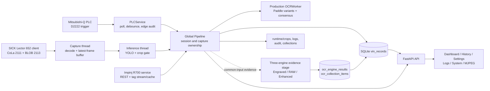
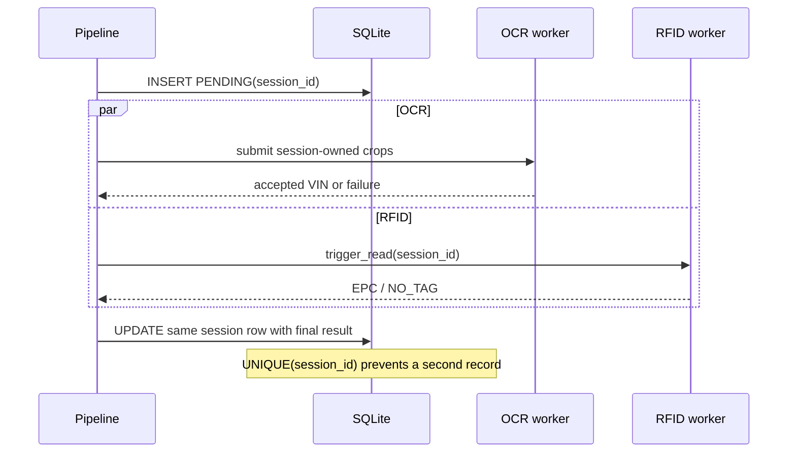

# AI_CAM v1.2.1 System Discovery Report

**Product framing:** AI_CAM v1.2.1 Production Stabilization

**Repository inspected:** `AI_CAM_v1.2.1_RELEASE`

**Inspection date:** 2026-07-29

**Audience:** Technical stakeholders and maintainers

## Technical summary

AI_CAM is a single-host industrial VIN-reading and traceability service for Station
509. A Mitsubishi-Q PLC event opens a body-cycle; RFID acquisition and camera
capture then run in parallel. The camera stream is decoded, a YOLO model locates
the VIN plate, and the best recent crops are sent to OCR. The accepted VIN, RFID
evidence, status, latency, and image path are finalized into one SQLite row per
session. FastAPI serves the operator dashboard, history, settings, logs, health,
metrics, exports, and an MJPEG stream.

The main runtime is a Python process containing one global `Pipeline`, device
service threads, camera capture/inference threads, and an OCR coordinator backed
by isolated child processes. The database is the durable session boundary:
`PENDING` is inserted when a cycle starts, then the same row is updated on
finalization. A unique `session_id` and compare-and-set-style finalization prevent
duplicate production rows.

The repository contains both the production Paddle/variant-consensus OCR path and
an additive three-engine evidence path (Engraved v1.2.1, Paddle RAW, Paddle
Enhanced). These are not currently the same decision path; this distinction is
documented in detail in `reports/AI_MODEL_ANALYSIS.md`.

## Evidence boundary and terminology

- This report is a static analysis of tracked repository files. No live PLC,
  camera, RFID reader, GPU host, production database, or 24-hour observation run
  was available in this task.
- Configuration values below are the **tracked defaults** in
  `config/settings.yaml`. Environment variables can override selected values at
  runtime (`backend/config.py:997-1012`).
- Executable code and tracked configuration are treated as authoritative. Existing
  prose is supporting context where it agrees with call sites.
- “Session” and “body-cycle” mean the unit created for one accepted PLC trigger.
  “Capture ownership” is narrower: a session can keep waiting for OCR/RFID after
  it releases the camera (`backend/pipeline.py:698-715`).

## High-level architecture

Primary evidence: the global pipeline is constructed at
`backend/pipeline.py:2526-2527`; the server wires PLC and RFID to it at
`backend/server.py:76-84`; FastAPI is created at `backend/server.py:142`.

## Runtime entry and lifecycle

### 1. Process bootstrap

1. `run.py` anchors the working directory to the release root and configures
   native-library discovery before workers are created
   (`run.py:37-57`).
2. CLI modes include self-check, dry-run, migration, health check, config print,
   no-hardware mode, VIN-slot shadow, and timed production observation
   (`run.py:240-280`).
3. Normal startup acquires a single-instance lock, runs release preparation, and
   launches Uvicorn on the configured host/port (`run.py:344-389`).

### 2. ASGI startup

The FastAPI lifespan:

- enforces authentication policy and initializes SQLite;
- probes configured network endpoints;
- applies the safe CPU/GPU runtime policy;
- preloads YOLO/Paddle;
- starts PLC and RFID services when enabled.

Evidence: `backend/server.py:89-119`.

### 3. Service run

The dashboard or PLC may connect/start processing. The tracked production
configuration enables PLC and RFID, uses a D2222 pulse trigger, and requests
`cuda:0` for detection (`config/settings.yaml:26-64`,
`config/settings.yaml:66-85`, `config/settings.yaml:109-129`).

### 4. Graceful shutdown

Shutdown stops PLC, finalizes/cancels open sessions, stops processing, disconnects
the camera, stops RFID and the three-engine evidence stage, and shuts down the OCR
pool (`backend/server.py:120-139`). Open sessions are durably finalized as
`CANCELLED` with `SERVICE_SHUTDOWN` (`backend/pipeline.py:1648-1672`).

## Body-cycle lifecycle

```mermaid
stateDiagram-v2
    [*] --> IDLE
    IDLE --> ACTIVE: accepted D2222 edge
    ACTIVE --> ACTIVE: duplicate/early trigger suppressed
    ACTIVE --> WAITING_RESULTS: plate exits; capture released
    ACTIVE --> FINALIZING: deadline or forced close
    WAITING_RESULTS --> FINALIZING: results complete or deadline
    FINALIZING --> SUCCESS: VIN and required RFID present
    FINALIZING --> TIMEOUT: required evidence missing
    FINALIZING --> FAILED: database/runtime failure
    FINALIZING --> CANCELLED: service shutdown
    SUCCESS --> IDLE
    TIMEOUT --> IDLE
    FAILED --> IDLE
    CANCELLED --> IDLE
```

1. `PLCService` converts the configured register value/bit into a stable trigger
   and, in pulse mode, does not interpret the falling edge as a session stop
   (`backend/plc/plc_service.py:318-351`, `backend/plc/plc_service.py:365-397`).
2. The pipeline rejects triggers when disk free space is critical. With the
   tracked `pending_trigger_queue_enabled: false`, a trigger during capture is
   suppressed and audited; a trigger sooner than 90 seconds is also suppressed
   (`backend/pipeline.py:746-825`; `config/settings.yaml:88-107`).
3. Session creation assigns a global timestamp/UUID identifier, inserts a
   `PENDING` database row, starts RFID immediately, starts camera processing, and
   starts a watchdog (`backend/pipeline.py:851-993`).
4. Capture and session ownership are deliberately decoupled. Plate exit stops new
   processing, pauses camera frame push, and releases capture while OCR/RFID
   results may continue (`backend/pipeline.py:2037-2082`).
5. The tracked profile sets `hold_until_deadline: true`,
   `require_rfid: true`, and `exit_signal_enabled: false`; therefore the watchdog
   owns the normal 30-second hard close instead of immediate VIN+RFID completion
   (`config/settings.yaml:88-107`; `backend/pipeline.py:1272-1306`,
   `backend/pipeline.py:1381-1424`).
6. `_finalize_session` atomically changes the state to `FINALIZING`, constructs
   explicit `NO_READ`/`NO_TAG` values rather than inventing evidence, updates the
   existing database row, and records terminal state
   (`backend/pipeline.py:1470-1628`).

## Camera and vision flow

- `Lector652Client` implements SICK Lector 652 CoLa-A control on port 2111 and
  BLOB streaming on port 2113. Its lifecycle is
  connect → `mLIStart` → read frames → `mLIStop` → disconnect
  (`backend/camera/camera_client.py:441-446`,
  `backend/camera/camera_client.py:589-614`).
- The capture thread performs socket reads and decoding only, stores the newest
  decoded frame, and drops stale frames to avoid backlog
  (`backend/pipeline.py:1701-1792`).
- The inference thread consumes the newest frame, runs YOLO, draws the operator
  overlay, optionally collects detector data, and invokes the crop/OCR gate
  (`backend/pipeline.py:1864-1918`).
- The detector treats all detections as one generic VIN-plate class; vehicle model
  is not assigned by YOLO (`backend/ai/detector.py:156-187`).
- The crop gate buffers quality-scored crops, requires consecutive evidence, and
  submits the best crops. A final strict session-level YOLO gate prevents crop
  quality from substituting for detector confidence
  (`backend/pipeline.py:2011-2126`, `backend/pipeline.py:1939-1949`).

The tracked YAML overrides `ocr_trigger_conf` to 0.85, while the dataclass retains
an additional `ocr_submit_min_yolo_conf` default of 0.90 because the YAML does not
override it (`config/settings.yaml:109-129`; `backend/config.py:100-130`;
`backend/config.py:953-971`). Thus a detection may enter the event buffer at 0.85,
but the production session still needs a peak confidence of at least 0.90 before
OCR submission.

## RFID flow

- The `RFIDService` maintains a reader and launches a per-trigger read worker;
  overlapping reads are rejected as busy (`backend/rfid/rfid_service.py:48-115`).
- The tracked R700 profile uses a 6-second first inventory window plus configured
  retry windows (`config/settings.yaml:66-85`;
  `backend/rfid/rfid_service.py:116-169`).
- Result ownership is checked against the session. Tags first observed before the
  session’s read window can be rejected as stale, protecting VIN/EPC binding
  (`backend/pipeline.py:1219-1267`).
- Missing RFID is stored as `NO_TAG` or `NO_READ`; it is not replaced with a
  guessed EPC (`backend/pipeline.py:1531-1544`).

## Persistence model

### Canonical production record

`vin_records` contains VIN/raw VIN/model, RFID/raw EPC, confidence, status, image,
session identity, trigger sequence, timestamps, failure reason, and latency
fields. `session_id` is unique (`backend/database/db.py:158-201`).

The write lifecycle is:

Evidence: pending insert at `backend/database/db.py:216-237`; update-first
finalization at `backend/database/db.py:240-289`; restart recovery at
`backend/database/db.py:292-315`.

### Additive OCR evidence

The v1.2.1 migration adds:

- `ocr_engine_results`: one row per engine execution and its raw/gated payload;
- `ocr_collection_items`: active-learning review candidates;
- `final_ocr_*` columns on `vin_records`.

Evidence: `backend/database/ocr_v121_db.py:33-108`. These evidence rows do not
violate the one-production-row invariant.

## Frontend and API surface

The server renders dashboard, history, settings, logs, and system pages
(`backend/server.py:267-293`). It also exposes:

- MJPEG live video: `backend/server.py:298-317`;
- camera and processing controls: `backend/server.py:367-408`;
- PLC/RFID status and simulator/manual-read endpoints:
  `backend/server.py:323-361`;
- metrics and health: `backend/server.py:411-469`;
- records, filters, CSV/XLSX export: `backend/server.py:730-786`;
- secret-masked settings management: `backend/server.py:790-968`;
- traversal-protected crop access: `backend/server.py:1052-1067`.

The frontend is server-rendered Jinja plus static JavaScript/CSS:
`frontend/templates/` and `frontend/static/`. It is not a separate SPA service.

## Module inventory

| Area | Source-of-truth modules | Responsibility |
|---|---|---|
| Launcher and release gates | `run.py`, `backend/release_startup.py`, `backend/runtime.py`, `backend/instance_lock.py` | Root anchoring, CLI modes, single-instance guard, dependency/model/DB gates, safe device policy |
| Web/API | `backend/server.py`, `backend/auth.py`, `backend/settings_store.py` | FastAPI lifecycle, pages, APIs, auth/CSRF, settings, health |
| Orchestration | `backend/pipeline.py` | Session state, capture ownership, camera/YOLO/OCR/RFID coordination, finalization |
| Camera | `backend/camera/camera_client.py` | SICK control/BLOB protocol, stream framing, robust decoding |
| Detector | `backend/ai/detector.py`, `backend/ai/crop_quality.py` | YOLO inference, plate crop, quality scoring |
| Production OCR | `backend/ai/ocr_worker.py`, `ocr_process.py`, `ocr_variants.py`, `vin_fusion.py`, `vin_rules.py` | Process isolation, preprocessing diversity, weighted position fusion, VIN gates |
| Three-engine OCR evidence | `backend/ai/ocr_shadow_hook.py`, `ocr_shadow_stage.py`, `ocr_orchestrator.py`, `engines/*` | Engraved/RAW/Enhanced concurrent evidence and collection |
| Dataset loop | `backend/ai/dataset_collector.py`, `ocr_collector.py`, `tools/build_collection_review_queue.py`, `tools/import_reviewed_collection.py` | Detector samples, uncertain glyph crops, manual-review queue, reviewed import |
| PLC | `backend/plc/plc_service.py`, `plc_melsec.py`, `edge_audit.py` | MC-protocol polling, pulse semantics, debounce/audit, optional done handshake |
| RFID | `backend/rfid/rfid_service.py`, `rfid_reader.py`, `r700_client.py`, `r700_stream.py`, `tag_cache.py` | R700 inventory/stream, tag cache, retries, EPC extraction |
| Persistence | `backend/database/db.py`, `ocr_v121_db.py`, `migrations/` | Canonical session row, evidence rows, migrations, recovery |
| Observability | `backend/logger.py`, `backend/production_runtime.py`, `tools/observe_production.py` | File/UI logs, network/disk/DB/process snapshots, observation reports |
| UI | `frontend/templates/`, `frontend/static/` | Operator controls, status, history, logs, settings, localization/theme |
| Deployment | `scripts/`, `deploy/`, `AI_CAM_v1.2.1.spec`, `build_exe.ps1`, `setup.ps1` | Windows package, Ubuntu/systemd support, install/update/rollback/backup |
| Verification | `tests/`, `tools/*selfcheck*.py`, `tools/smoke_startup.py` | Unit, stress, chaos, migration, OCR, frontend, release and smoke checks |

## Configuration and portable paths

Runtime paths derive from the project root and default under `runtime/`; model
artifacts default under `models/` (`backend/config.py:16-55`). The main tracked
settings surface is `config/settings.yaml`; `backend/config.py:953-994` applies
known fields, resolves model paths, then applies selected environment overrides.

Key tracked directories:

| Path | Role |
|---|---|
| `models/yolo/` | VIN-plate detector checkpoint |
| `models/paddle/{det,rec,cls}/` | Local PaddleOCR inference artifacts |
| `models/engraved_ocr_v1.2.1/` | ONNX/PyTorch engraved-character model and model card |
| `runtime/data/` | SQLite database |
| `runtime/crops/` | Accepted and failure-evidence images |
| `runtime/logs/` | Runtime/startup logs |
| `runtime/audit/` | PLC and suppressed-trigger evidence |
| `runtime/engraved_ocr_collection/` | OCR active-learning sessions |
| `runtime/dataset_collected/` | Optional YOLO auto-collection |

## Existing documentation and reports

The most relevant supporting documents are:

- `README.md`
- `docs/ARCHITECTURE.md`
- `docs/OCR_FUSION.md`
- `docs/DATASET_CHARACTER_ALIGNMENT.md`
- `docs/FAILURE_EVIDENCE.md`
- `docs/PLC_AND_CONFIG.md`
- `docs/OCR_V121_ARCHITECTURE.md`
- `docs/PRODUCTION_OBSERVATION.md`
- `reports/FINAL_RELEASE_CONSOLIDATION_REPORT.md`
- `reports/BUILD_PROVENANCE.md`

These are useful context, but several comments/documents describe intended
behavior more strongly than current call sites. The implementation distinctions
in this report and `AI_MODEL_ANALYSIS.md` should be retained in any presentation.

## Strengths visible in the code

1. **Explicit ownership and idempotency.** Session IDs travel with OCR/RFID work,
   finalization has a state guard, and SQLite has a unique constraint.
2. **Failure containment.** Paddle runs in child processes; device and evidence
   failures are isolated; shutdown and restart recovery preserve an audit row.
3. **Low-latency camera design.** Capture and inference are decoupled with a
   latest-frame buffer instead of an unbounded backlog.
4. **Evidence preservation.** Raw VIN, raw EPC, failure crops, per-engine results,
   timestamps, latency, and reasons are retained.
5. **Operational visibility.** The API exposes health/metrics and the pipeline
   records pre-OCR stage counters to distinguish decode, detection, crop, submit,
   engine, and acceptance failures.
6. **Portable artifact layout.** Models and writable runtime state are explicitly
   rooted rather than depending on a user cache.

## Risks, inconsistencies, and improvement opportunities

| Priority | Finding | Evidence and implication |
|---|---|---|
| High | The tracked three-engine `GUARDED_PRIMARY` setting does not make Engraved OCR the production VIN authority in the current pipeline hook. | `config/settings.yaml:200-217` says `GUARDED_PRIMARY`, but the common-input stage is called with `write_final=False` (`backend/ai/ocr_shadow_hook.py:164-183`) and production binding comes from `OCRWorker` (`backend/pipeline.py:2003`, `backend/pipeline.py:2218-2292`). Presentation language must describe it as an evidence stage unless integration changes. |
| High | “Never invent” is not literal for the production VIN validator because fixed positions can be forced. | `backend/ai/vin_postprocess.py:176-188` and `backend/ai/vin_fusion.py:182-216` can force N/S/T/1/J. Raw OCR is retained, but slides should say “rule-constrained correction with raw audit,” not “no substitution.” |
| Medium | The active-learning metadata contract and SQLite schema differ. | Collector items contain `alignment_source` and `training_eligible` (`backend/ai/ocr_collector.py:180-215`), while `ocr_collection_items` and its insert key list omit both (`backend/database/ocr_v121_db.py:58-80`, `backend/database/ocr_v121_db.py:150-160`). Those fields survive in session `metadata.json`, not the database row. |
| Medium | Generic OCR engine-router configuration is not the live pipeline selector. | `build_router_from_config` exists in `backend/ai/engines/factory.py:40-50`, but repository call sites use it for startup/health/tests; the global pipeline directly constructs `OCRWorker` at `backend/pipeline.py:175-178`. |
| Medium | Configuration comments contain stale thresholds/modes. | Code comments mention 0.95 and rec-only in places, while tracked YAML uses 0.85 detection entry, a separate 0.90 submit gate, and `paddle_det: true`. Executable values should be shown, not comments. |
| Medium | The 30-second strict hold trades traceability completeness for cycle latency. | With tracked `hold_until_deadline: true` and required RFID, early completion is blocked (`backend/pipeline.py:1293-1300`). Confirm that this is still the desired production contract. |
| Low | Internal comments use “v1.3.0” for several stabilization changes even though the release version is 1.2.1. | `backend/version.py:8-23` reads the canonical repository `VERSION`, while examples include `backend/pipeline.py:163-166` and `config/settings.yaml:54-61`. Stakeholder artifacts should consistently use **AI_CAM v1.2.1 Production Stabilization**. |
| Low | The detector can fall back to generic `yolov8n.pt` if `best.pt` is missing. | `backend/ai/detector.py:113-149`. Startup artifact validation should remain mandatory so production never silently operates on a generic model. |

## Explicit unknowns

- Exact Mitsubishi PLC CPU/module model and firmware: **unknown**. The repo states
  PLC type `Q` and MC protocol, not a full hardware part number.
- Physically installed camera identity/firmware: the client and documentation say
  SICK Lector 652, but no device export/serial was inspected.
- Actual GPU model, driver, CUDA/cuDNN state, and live inference device: **unknown**.
  The tracked profile requests `cuda:0`; README’s GTX 1650 is an example, not
  verified hardware.
- YOLO training dataset, class map artifact, evaluation metrics, and calibration:
  **not present as a model card in this repository**.
- Paddle det/rec/cls model family names, training provenance, evaluation metrics,
  and checksums: **not documented in the bundled model directories**.
- Live network reachability, camera payload format, PLC pulse quality, RFID read
  rate, database volume, and 24-hour observation result: **not verified here**.
- Effective deployed configuration may differ from tracked YAML through
  environment overrides.

## Documentation recommendations

1. Present the system as one body-cycle state machine with parallel VIN/RFID
   acquisition and a durable one-row session record.
2. Show capture ownership separately from session lifetime; this is the clearest
   explanation for why the camera can be ready while OCR/RFID still drain.
3. Label the current OCR authority explicitly: “Paddle variant consensus
   (production)” and “Engraved + RAW + Enhanced (parallel evidence/collection).”
4. Keep hardware part numbers marked unverified until the hardware research report
   confirms them from device/manufacturer sources.
5. Preserve the tracked-config-versus-live-config qualifier on every slide that
   shows IPs, thresholds, GPU mode, or timeouts.
